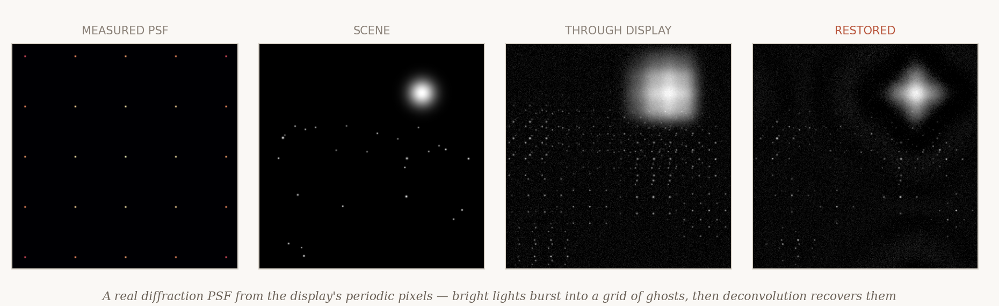
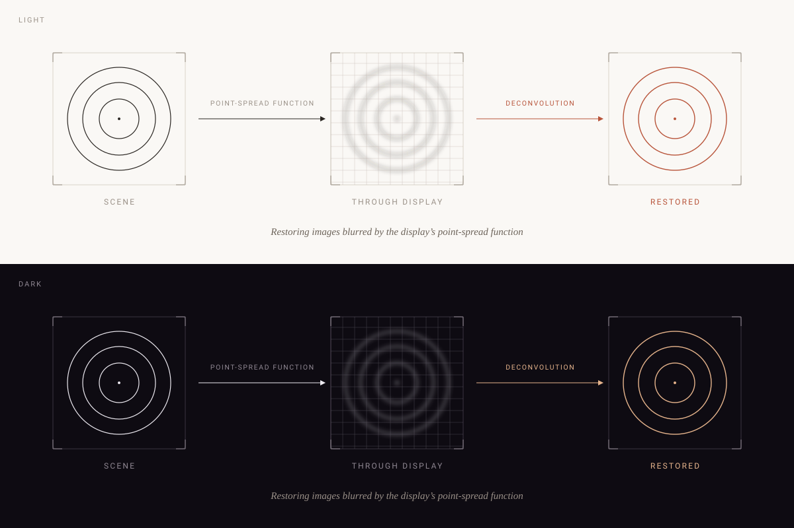

+++
title = "Diagram redesign preview"
+++

# Diagram redesign — preview

*Temporary, unlinked preview page for reviewing the refined diagram language
(camera-behind-display). Delete before going live.*

## Grounded alternative — simulate the real physics

Instead of an abstract schematic, this is generated from the actual optics: a display's periodic
sub-pixel apertures produce a real diffraction **PSF** (the grid of ghosts), a night scene is blurred
*through* it, and Wiener **deconvolution** recovers it. Real imagery, not a chart.

---

## Fixed comparison — both grounds

Top = **light** (paper · ink · terracotta). Bottom = **dark** (near-black · off-white · peach).
This is baked so you see both regardless of your system theme.

## Adaptive version — follows your system theme

The real diagram is a **single transparent SVG** that switches automatically via
`prefers-color-scheme`. Toggle your OS appearance (light/dark) and this one flips.
Shown here on the live page background:

