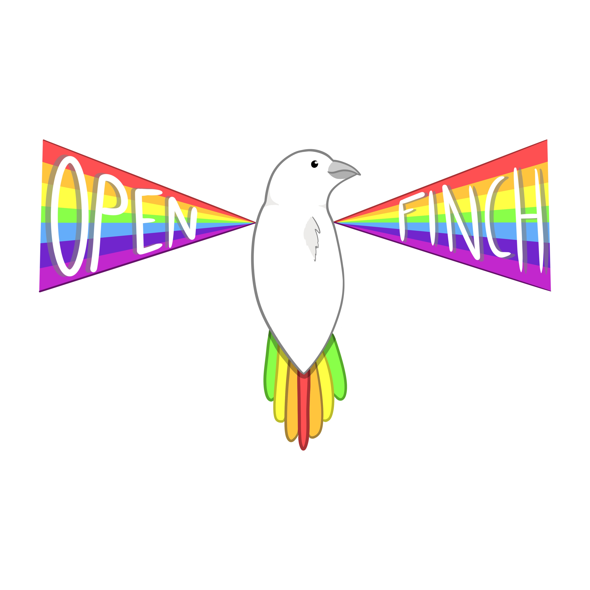
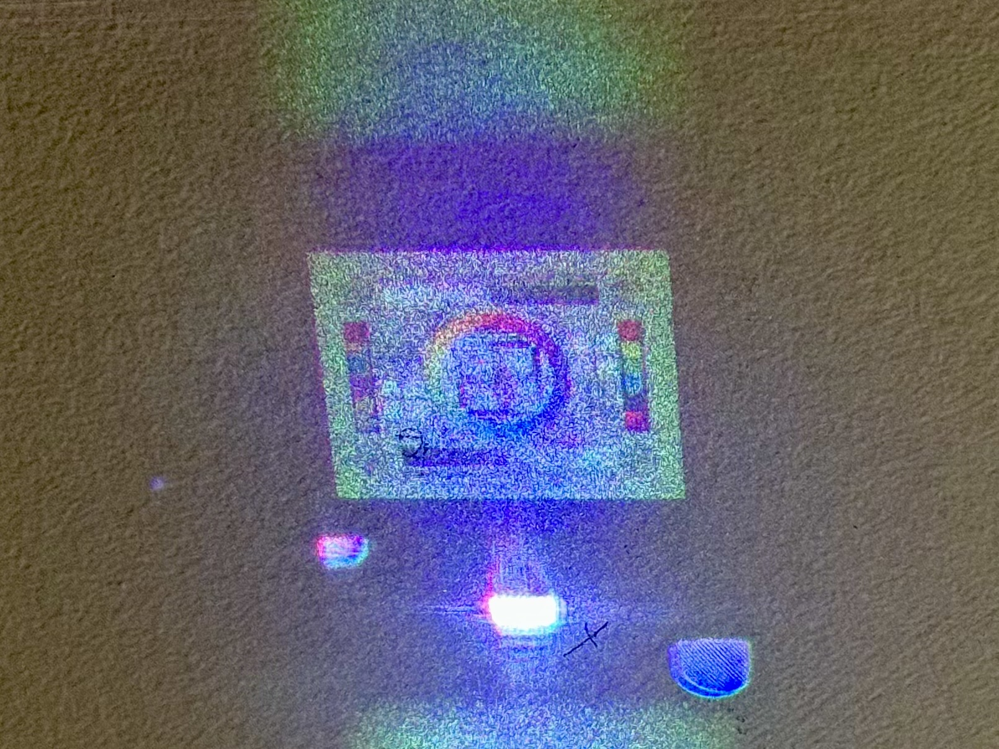

+++
title = "OpenFinch at OpenSauce 2024"
tags = ["index"]
auto_code_path = true
has_math = true
+++

# OpenFINCH at OpenSauce 2024

* [OpenFinch.jl](https://github.com/rehmi/OpenFinch.jl)
* [SLM-VERA](https://github.com/rehmi/SLM-VERA)
