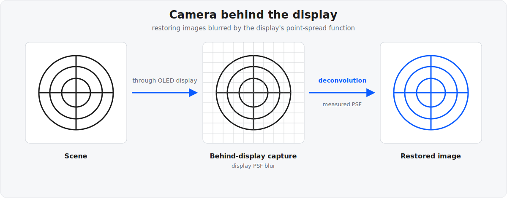

+++
title = "Camera Behind the Display"
project_date = "2020–2022"
tags = ["computational-imaging", "optics", "samsung"]
project_thumb = "/assets/thumbnails/other/camera-behind-display/thumb.svg"
+++

# Camera Behind the Display

## Overview

Under-display cameras hide a device's front camera behind the active screen, freeing
the whole display of notches and cutouts. But shooting *through* a semi-transparent pixel
grid turns the display itself into an optical element in the imaging path: it diffracts and
scatters incoming light, convolving every frame with the display's point-spread function
(PSF) and leaving the raw capture blurred, low in contrast, and prone to flare around bright
sources.

At Samsung Research America's Think Tank Team, Rehmi Post developed real-time image-deblurring
algorithms that restore a clean image from what the sensor actually sees behind the display.
The core idea is to measure the display's PSF and then invert it — deconvolving the blur out
of each frame — with a family of methods that grew from computational reconstruction to
high-dynamic-range PSF handling, flare mitigation, and ultimately moving part of the
correction out of software and into a purpose-designed optical element.

## How it works

- **Measure the PSF.** The display's repeating pixel and aperture structure produces a
  characteristic, wavelength-dependent point-spread function. Capturing it against known point
  sources yields a per-channel model of exactly how the display blurs light.
- **Deconvolve per channel.** Each color channel of the raw capture is deconvolved against its
  measured PSF to remove the display-induced blur.
- **Handle high dynamic range.** Bright highlights blow out the tails of the PSF; generating an
  HDR PSF (paired with a low-resolution companion) keeps the reconstruction stable even when the
  PSF is widely dispersed.
- **Use multiple PSFs.** A single PSF is not uniform across the frame, so patch-based,
  multiple-PSF reconstruction with interpolation handles the spatial variation.
- **Mitigate flare.** Pairing deconvolution with high-dynamic-range imaging suppresses the flare
  that display structures throw around bright light sources.
- **Optimize the display itself.** Rather than only correcting after capture, an automated search
  iterates PSF computation against image-quality metrics to improve the physical display-pixel
  structure for under-display cameras.
- **Move correction into optics.** A physical optical element pre-corrects the display-induced
  blur through wavelength-dependent phase modulation — shifting part of the deconvolution from
  computation into hardware.

A related thread applied the same light-field and PSF thinking to depth sensing: an incoherent
digital-holography depth camera that recovers depth from ordinary ambient light, with no active
illuminator required.

## Patents

The work is documented across a family of issued and pending US patents:

- [Processing Images Captured by a Camera Behind a Display — US11575865](https://patents.google.com/patent/US11575865B2) (2023)
- [Multiple Point Spread Function Based Image Reconstruction — US11721001](https://patents.google.com/patent/US11721001B2) (2023)
- [Self-regularizing Inverse Filter for Image Deblurring — US11722796](https://patents.google.com/patent/US11722796B2) (2023)
- [High Dynamic Range Point Spread Function Generation — US11637965](https://patents.google.com/patent/US11637965B2) (2023) · [US11343440](https://patents.google.com/patent/US11343440B1) (2022)
- [Flare Mitigation via Deconvolution using HDR Imaging — US11889033](https://patents.google.com/patent/US11889033B2) (2024)
- [Airy-Disk Correction for Deblurring an Image — US20240169497](https://patents.google.com/patent/US20240169497A1) (2024, pending)
- [Optical Element for Deconvolution — US12216277](https://patents.google.com/patent/US12216277B2) (2025)
- [Restoring Images Using Deconvolution — US12393765](https://patents.google.com/patent/US12393765B2) (2025)
- [Automating Search for Improved Display Structure for UDC Systems — US12482075](https://patents.google.com/patent/US12482075B2) (2025)
- [Incoherent Digital Holography Based Depth Camera — US11443448](https://patents.google.com/patent/US11443448B2) (2022)

See the [patents page](/PATENTS/) for the complete portfolio.

## Credits

Developed at the Samsung Research America Think Tank Team, with co-inventors including
Changgeng Liu, Sajid Sadi, Kishore Rathinavel, and Kushal Kardam Vyas.
