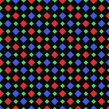
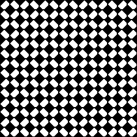
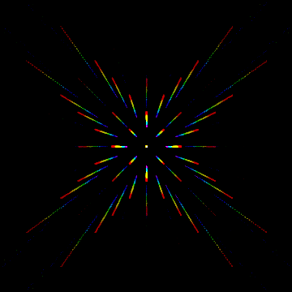
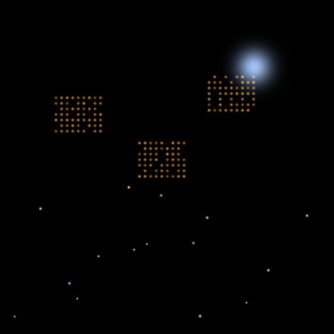
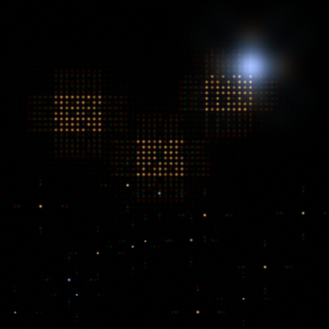
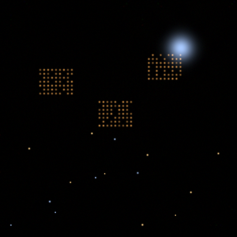
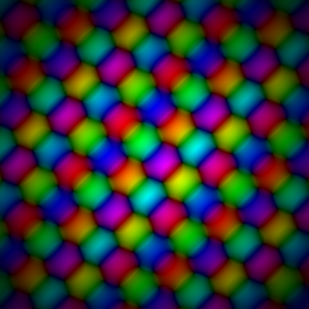
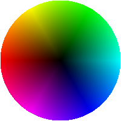
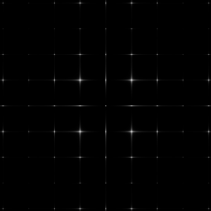
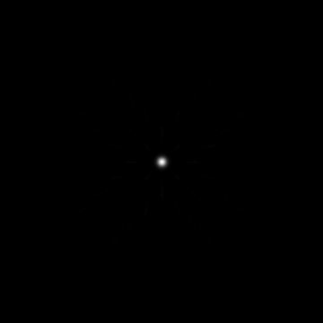

+++
title = "Camera Behind the Display"
project_date = "2020–2022"
tags = ["computational-imaging", "optics", "samsung"]
project_thumb = "/assets/thumbnails/other/camera-behind-display/thumb.png"
+++

# Camera Behind the Display

~~~

  

    

OLED sub-pixels

    

Aperture · the diffractive mask

    

White-light PSF

  

  
A camera behind an OLED shoots through the small gaps between the opaque sub-pixel electrodes and the thin-film metal row/column interconnects. That fine periodic aperture diffracts light; summing the diffraction across the visible spectrum (400–700 nm in 5 nm steps) gives the white-light PSF — a rainbow starburst, each order dispersing from blue at the center to red at the edge.

~~~

## Overview

Under-display cameras hide a device's front camera behind the active screen, freeing the whole
display of notches and cutouts. But shooting *through* a semi-transparent pixel grid turns the
display into an optical element in the imaging path: its periodic structure acts like a diffraction
grating, so every frame is convolved with the display's point-spread function (PSF) — a
wavelength-dependent smear that leaves the raw capture blurred, low in contrast, ghosted around
bright points, and prone to flare.

At Samsung Research America's Think Tank Team, Rehmi Post developed real-time image-deblurring
algorithms that restore a clean image from what the sensor actually sees behind the display. The
core idea is to measure the display's PSF and then invert it — deconvolving the blur out of each
frame — with a family of methods that grew from computational reconstruction to high-dynamic-range
PSF handling, flare mitigation, and ultimately moving part of the correction out of software and
into a purpose-designed optical element.

## How it works

- **Measure the PSF.** The display's repeating pixel and aperture structure diffracts light into a
  characteristic, wavelength-dependent point-spread function — a bright core surrounded by a grid of
  diffraction orders and cross-spikes (above, right). Capturing it against known point sources
  gives a per-channel model of exactly how the display blurs light.
- **Deconvolve per channel.** Each color channel of the raw capture is deconvolved against its
  measured PSF with an inverse filter to remove the display-induced blur.
- **Handle high dynamic range.** Bright highlights blow out the tails of the PSF; generating an HDR
  PSF (paired with a low-resolution companion) keeps the reconstruction stable even when the PSF is
  widely dispersed.
- **Use multiple PSFs.** A single PSF is not uniform across the frame, so patch-based, multiple-PSF
  reconstruction with interpolation handles the spatial variation.
- **Mitigate flare.** Pairing deconvolution with high-dynamic-range imaging suppresses the flare that
  display structures throw around bright light sources.
- **Optimize the display itself.** Rather than only correcting after capture, an automated search
  iterates PSF computation against image-quality metrics to improve the physical display-pixel
  structure for under-display cameras.

~~~

  

    

Scene

    

Through display

    

Restored

  

  
Imaged through the display, the scene is blurred and chromatically ghosted; per-channel inverse-filter deconvolution recovers the detail and colour.

~~~

## Correcting the blur in optics

The last step moves the deconvolution out of software altogether: a **diffractive optical element**
that pre-corrects the display-induced blur through wavelength-dependent phase modulation
([US12216277](https://patents.google.com/patent/US12216277B2), sole inventor E. R. Post). Because it
is a diffractive element, its transmittance is complex — a spatially varying *phase* as well as
amplitude:

~~~

  

    

Corrective element

    

Phase legend

  

  
The element's complex transmittance, domain-coloured: <strong>hue = phase</strong> (the wheel), <strong>brightness = magnitude</strong>. Its phase profile redirects the display's diffracted orders.

~~~

Applied in the imaging path, it collapses the system point-spread function from a spread of
diffraction orders back toward a compact point — moving the correction from software into optics:

~~~

  

    

PSF · display only

    

PSF · + element

  

  
The diffractive corrector collapses the system PSF back toward a compact point.

~~~

A related thread applied the same light-field and PSF thinking to depth sensing: an incoherent
digital-holography depth camera that recovers depth from ambient light with no active illuminator.

*All figures on this page are illustrative wave-optics simulations built from a generic
Diamond-PenTile OLED aperture (public sub-pixel geometry) — not Samsung hardware, masks, or data.*

## Patents

The work is documented across a family of issued and pending US patents:

- [Processing Images Captured by a Camera Behind a Display — US11575865](https://patents.google.com/patent/US11575865B2) (2023)
- [Multiple Point Spread Function Based Image Reconstruction — US11721001](https://patents.google.com/patent/US11721001B2) (2023)
- [Self-regularizing Inverse Filter for Image Deblurring — US11722796](https://patents.google.com/patent/US11722796B2) (2023)
- [High Dynamic Range Point Spread Function Generation — US11637965](https://patents.google.com/patent/US11637965B2) (2023) · [US11343440](https://patents.google.com/patent/US11343440B1) (2022)
- [Flare Mitigation via Deconvolution using HDR Imaging — US11889033](https://patents.google.com/patent/US11889033B2) (2024)
- [Airy-Disk Correction for Deblurring an Image — US20240169497](https://patents.google.com/patent/US20240169497A1) (2024, pending)
- [Optical Element for Deconvolution — US12216277](https://patents.google.com/patent/US12216277B2) (2025)
- [Restoring Images Using Deconvolution — US12393765](https://patents.google.com/patent/US12393765B2) (2025)
- [Automating Search for Improved Display Structure for UDC Systems — US12482075](https://patents.google.com/patent/US12482075B2) (2025)
- [Incoherent Digital Holography Based Depth Camera — US11443448](https://patents.google.com/patent/US11443448B2) (2022)

See the [patents page](/PATENTS/) for the complete portfolio.

## Credits

Developed at the Samsung Research America Think Tank Team, with co-inventors including
Changgeng Liu, Sajid Sadi, Kishore Rathinavel, and Kushal Kardam Vyas.
