+++
title = "Camera Behind the Display"
project_date = "2020–2022"
tags = ["computational-imaging", "optics"]
project_thumb = "/assets/thumbnails/other/camera-behind-display/thumb.png"
+++

# Camera Behind the Display

~~~
<figure style="max-width:560px;margin:2rem auto;text-align:center;">
  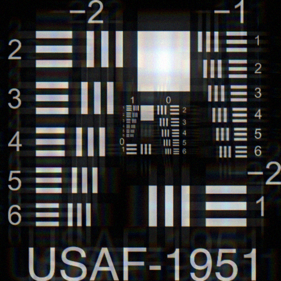
  <figcaption class="fig-note" style="margin-top:0.7rem;">A USAF-1951 resolution chart as an under-display camera sees it — crisp white bars smeared into colored diffraction replicas by the pixel grid the camera must shoot through.</figcaption>
</figure>
~~~

## Overview

Under-display cameras hide a device's front camera behind the active screen, freeing the whole
display of notches and cutouts. But shooting *through* a semi-transparent pixel grid turns the
display into an optical element in the imaging path: its periodic structure acts like a diffraction
grating, so every frame is convolved with the display's point-spread function (PSF) — a
wavelength-dependent smear that leaves the raw capture blurred, low in contrast, ghosted around
bright points, and prone to flare.

We developed real-time image-deblurring algorithms that restore a clean image from what the sensor
actually sees behind the display. The core idea is to measure the display's PSF and then invert it —
deconvolving the blur out of each frame — with a family of methods that grew from computational
reconstruction to high-dynamic-range PSF handling, flare mitigation, and ultimately moving part of
the correction out of software and into a purpose-designed optical element.

~~~

  

    

OLED sub-pixels

    

Aperture · the diffractive mask

    

White-light PSF

  

  
<strong>Figure 1.</strong> Why: a camera behind an OLED shoots through the small gaps between the opaque sub-pixel electrodes and the thin-film metal row/column interconnects. That fine periodic aperture diffracts light; summing the diffraction across the visible spectrum (400–700 nm in 5 nm steps) gives the white-light PSF — a rainbow starburst, each order dispersing from blue at the center to red at the edge (tone-mapped to show the faint higher orders).

~~~

## The character of the distortion

Here is what that looks like. Shooting through the display convolves every frame with its
point-spread function — blur, wavelength-dependent ghosting around bright edges, and a veiling haze
that sinks contrast. A high-contrast target makes the character unmistakable: white bars on black
split into colored diffraction replicas.

~~~

  

    

Real scene
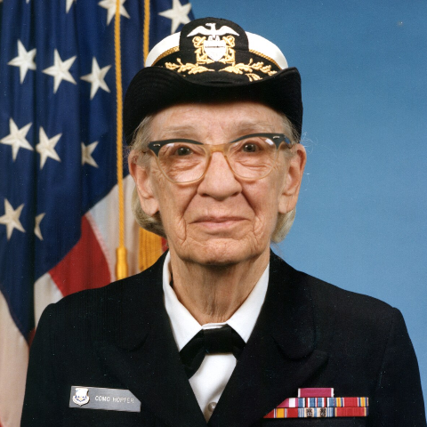

    

Through the display
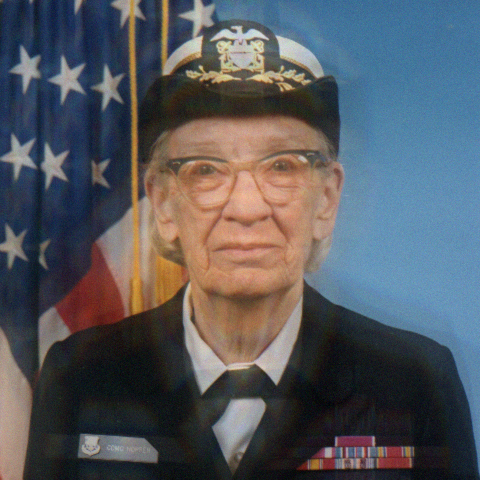

  

  

    

USAF-1951 target
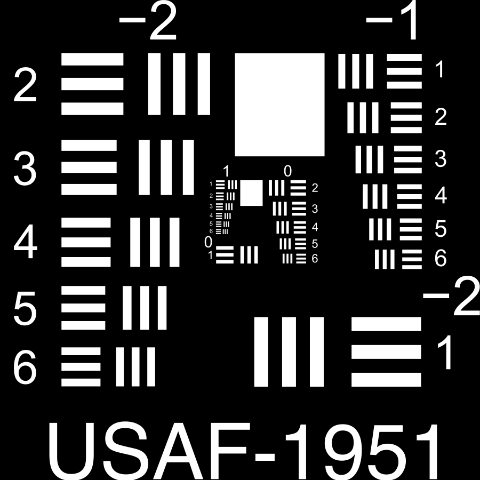

    

Through the display

  

  
<strong>Figure 2.</strong> A real scene and a high-contrast target as the sensor sees them behind the display. Fine detail is lost to blur, bright edges throw wavelength-dependent ghosts, and contrast washes out under veiling glare — white bars on black make the chromatic character plain.

~~~

## Optical model

A plan view of the imaging path, drawn as in an optics text — light travels left to right, from a
distant scene through the display to the sensor. The display's periodic aperture (pitch $\Lambda$)
acts as a diffraction grating, spreading each scene point into a grid of diffraction orders on the
sensor.

~~~

  

    

Camera behind the display — the display as a diffraction grating
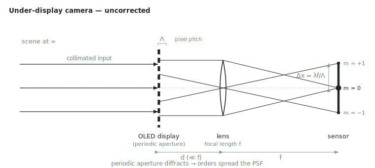

  

  
<strong>Figure 3.</strong> Plan view of the under-display camera. The display sits a small gap <em>d</em>&nbsp;≪&nbsp;<em>f</em> in front of a lens of focal length <em>f</em>; its periodic aperture diffracts each scene point into orders spaced Δx&nbsp;=&nbsp;λ<em>f</em>/Λ on the sensor.

~~~

Writing $f$ for the ideal image, $h$ for the system point-spread function (PSF) and $n$ for sensor
noise, image formation through the display is a convolution:

$$ g \;=\; f \ast h \;+\; n. $$

The PSF follows from the aperture. With a combined pupil $A(u,v) = P(u,v)\,t(u,v)$ — the lens pupil
$P$ times the display's transmittance $t$ — the incoherent PSF is the squared modulus of its Fourier
transform,

$$ h(x,y)\;\propto\;\Bigl|\,\mathcal{F}\{A\}\bigl(\tfrac{x}{\lambda f},\,\tfrac{y}{\lambda f}\bigr)\Bigr|^{2}. $$

Because $t$ is periodic with pitch $\Lambda$, $\mathcal{F}\{A\}$ breaks into diffraction orders obeying
the grating equation $\sin\theta_m = m\lambda/\Lambda$, which land on the sensor at

$$ x_m \;=\; m\,\frac{\lambda f}{\Lambda},\qquad m = 0,\pm 1,\pm 2,\dots $$

so $h$ is a bright core ringed by wavelength-dispersed side orders spaced $\Delta x = \lambda f/\Lambda$
— the smear seen behind the display. Because $h$ depends on wavelength, the correction is applied per
color channel.

**Key dimensions** (representative, not device values): display pixel/aperture pitch
$\Lambda \sim 40$–$60\ \mu\mathrm{m}$; display-to-lens gap $d \lesssim 1\ \mathrm{mm}$, with $d \ll f$;
and lens focal length $f$ of a few millimeters.

## Reconstruction — the naive inverse filter

Measuring the display's PSF lets us undo it — restoring the image by deconvolution~~~<a href="https://patents.google.com/patent/US11575865B2">1</a>~~~,~~~<a href="https://patents.google.com/patent/US12482075B2">2</a>~~~.
The first method deconvolves each color channel of the raw capture against its measured PSF with a
**Wiener inverse filter** — a regularized inverse that divides out the blur in the Fourier domain,

$$ \hat X \;=\; \frac{H^{\ast}}{|H|^{2}+K}\,G,\qquad \hat x = \mathcal{F}^{-1}\{\hat X\}, $$

where capitals are Fourier transforms and the single constant $K$ guards the division where the PSF
is weak. Run per channel, it brings back most of the resolution and color at once:

~~~

  

    

Through display

    

Naive Wiener · 25.6 dB

  

  

    

Through display

    

Naive Wiener · 25.8 dB
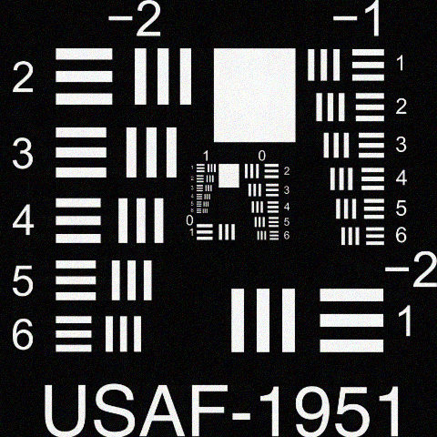

  

  
<strong>Figure 4.</strong> A per-channel Wiener inverse filter with a single fixed regularization restores most of the resolution and color, but one global constant leaves residual grain and ringing (PSNR against the original).

~~~

But one global $K$ is a compromise: small enough to resolve fine detail, it also amplifies noise into
grain and rings high-contrast edges. The full forward model and both filters are on the
[diffraction &amp; reconstruction code](/projects/camera-behind-display/code/) page.

## A sharper reconstruction — the self-regularizing inverse filter

The **self-regularizing inverse filter** removes that hand-tuned constant~~~<a href="https://patents.google.com/patent/US11722796B2">3</a>~~~. Instead of one number, it penalizes
high-frequency roughness through a Laplacian operator $C$ and lets the filter set its own
regularization from the residual and noise — a constrained-least-squares inverse:

$$ \hat X \;=\; \frac{H^{\ast}}{|H|^{2}+\gamma\,|C|^{2}}\,G. $$

The penalty is heavy at high spatial frequencies, where the inverse would amplify noise into ringing
and grain, and light where the image energy lives — so flat regions and edges come back clean at the
same sharpness, with no per-image tuning:

~~~

  

    

Naive Wiener · 25.6 dB

    

Self-regularizing · 31.8 dB

  

  

    

Naive Wiener · 25.8 dB

    

Self-regularizing · 28.9 dB
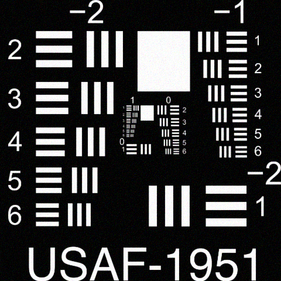

  

  
<strong>Figure 5.</strong> Deriving its regularization from the PSF rather than a hand-tuned constant, the self-regularizing filter clears the residual noise and ringing at the same sharpness — about a 3–6 dB PSNR gain over the naive reconstruction.

~~~

~~~

  

    

Naive Wiener

    

Self-regularizing

    

Original
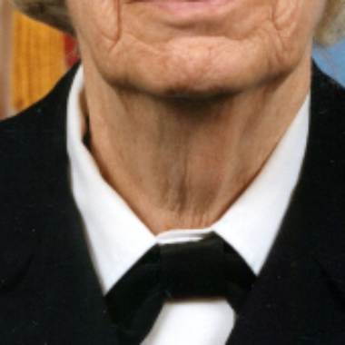

  

  

    

Naive Wiener
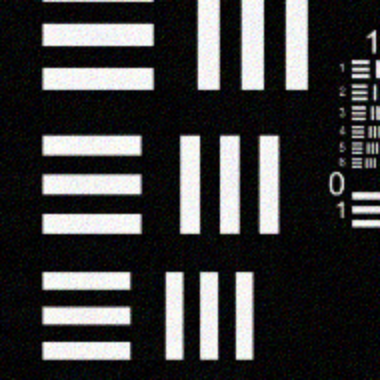

    

Self-regularizing
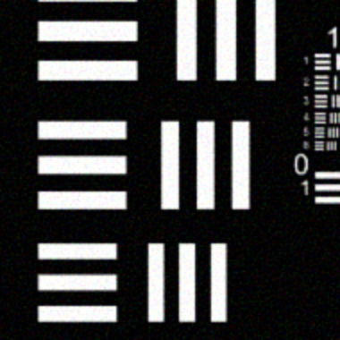

    

Original
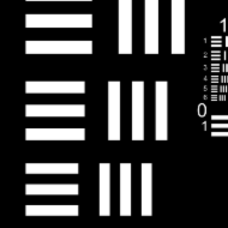

  

  
<strong>Figure 6.</strong> The same regions magnified — naive Wiener, self-regularizing, and the original. The naive filter leaves chromatic grain in flat areas and rougher edges; the self-regularizing filter recovers detail close to the original at matched sharpness.

~~~

## Correcting the blur in optics

The last step moves the deconvolution out of software altogether: a **diffractive optical element**
that pre-corrects the display-induced blur through wavelength-dependent phase modulation~~~<a href="https://patents.google.com/patent/US12216277B2">4</a>~~~. Placed at the pupil — a short
distance $s$ ahead of the lens — it redirects the display's diffraction orders so the lens brings them
to a common focus:

~~~

  

    

With the corrective diffractive element at the pupil
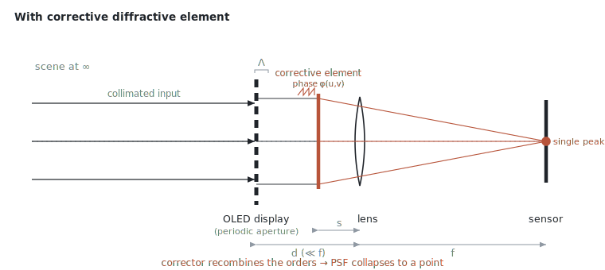

  

  
<strong>Figure 7.</strong> A phase-only diffractive element at the aperture stop, a distance <em>s</em> ahead of the lens, redirects the display's diffraction orders back onto a common focus — collapsing the spread PSF to a point.

~~~

Formally, the element is a phase-only transmittance $t_c(u,v)=e^{\,i\phi(u,v)}$ at the pupil, with
$\phi$ chosen so the combined aperture $A$ transforms to a compact spot:

$$ \bigl|\,\mathcal{F}\{A\,e^{\,i\phi}\}\,\bigr|^{2}\;\longrightarrow\;\text{single peak}. $$

The phase $\phi$ flattens the relative phase across the diffraction orders so they recombine at the
core. Because it is a diffractive element, its transmittance is complex — a spatially varying *phase*
as well as amplitude:

~~~

  

    

Corrective element

    

Phase legend

  

  
<strong>Figure 8.</strong> The element's complex transmittance, domain-colored: <strong>hue = phase</strong> (the wheel), <strong>brightness = magnitude</strong>. Its phase profile redirects the display's diffracted orders.

~~~

Applied in the imaging path, this collapses the system point-spread function from a spread of
diffraction orders back toward a compact point:

~~~

  

    

PSF · display only

    

PSF · + element

  

  
<strong>Figure 9.</strong> The diffractive corrector collapses the system PSF back toward a compact point.

~~~

## Other innovations

The same measure-and-invert idea runs through the rest of the patent family:

- **High-dynamic-range PSF.** Bright highlights blow out the tails of the PSF; generating an HDR PSF
  paired with a low-resolution companion keeps the reconstruction stable when the PSF is widely
  dispersed~~~<a href="https://patents.google.com/patent/US11637965B2">5</a>~~~.
- **Flare mitigation.** Pairing deconvolution with high-dynamic-range imaging suppresses the flare
  display structures throw around bright light sources~~~<a href="https://patents.google.com/patent/US11889033B2">6</a>~~~.
- **Multiple, patch-based PSFs.** A single PSF is not uniform across the frame, so patch-based
  reconstruction with multiple PSFs and interpolation handles the spatial variation~~~<a href="https://patents.google.com/patent/US11721001B2">7</a>~~~.
- **Airy-disk correction.** Correcting the residual Airy-disk blur further sharpens the recovered
  image~~~<a href="https://patents.google.com/patent/US12651320B2">8</a>~~~.
- **Optimizing the display itself.** Rather than only correcting after capture, an automated search
  iterates PSF computation against image-quality metrics to improve the physical display-pixel
  structure for under-display cameras~~~<a href="https://patents.google.com/patent/US12393765B2">9</a>~~~.
- **Depth from ambient light.** A related thread applied the same light-field and PSF thinking to an
  incoherent digital-holography depth camera that recovers depth with no active illuminator~~~<a href="https://patents.google.com/patent/US11443448B2">10</a>~~~.

## Credits and acknowledgments

Developed at the Samsung Research America Think Tank Team. Named co-inventors across the
under-display-camera patent family: Changgeng Liu, Sajid Sadi, Ye Zhao, Luxi Zhao, Brian R. Patton,
Congzhong Guo, Ziwen Jiang, Gustavo Alejandro Guayaquil Sosa, Kishore Rathinavel,
Kushal Kardam Vyas, Nigel Clarke, Abdelrahman Abdelhamed, Abhijith Punnappurath, and Michael Brown.

The simulations and methods on this page are derived from the publicly issued patents referenced
throughout; each technique is attributed to its specific patent where it is introduced, and every
figure is an illustrative wave-optics reconstruction from a generic, public OLED sub-pixel geometry.
The test images are a USAF-1951 resolution chart~~~<a href="https://commons.wikimedia.org/wiki/File:USAF-1951.svg">11</a>~~~
and a public-domain U.S. Navy photograph of Grace Hopper~~~<a href="https://commons.wikimedia.org/wiki/File:Grace_Hopper.tiff">12</a>~~~.

## References

@@reflist
1. *Processing Images Captured by a Camera Behind a Display.* [US 11,575,865](https://patents.google.com/patent/US11575865B2) (2023).
2. *Restoring Images Using Deconvolution.* [US 12,482,075](https://patents.google.com/patent/US12482075B2) (2025).
3. *Self-regularizing Inverse Filter for Image Deblurring.* [US 11,722,796](https://patents.google.com/patent/US11722796B2) (2023).
4. *Optical Element for Deconvolution.* [US 12,216,277](https://patents.google.com/patent/US12216277B2) (2025).
5. *High Dynamic Range Point Spread Function Generation.* [US 11,637,965](https://patents.google.com/patent/US11637965B2) (2023); [US 11,343,440](https://patents.google.com/patent/US11343440B1) (2022).
6. *Flare Mitigation via Deconvolution using HDR Imaging.* [US 11,889,033](https://patents.google.com/patent/US11889033B2) (2024).
7. *Multiple Point Spread Function Based Image Reconstruction.* [US 11,721,001](https://patents.google.com/patent/US11721001B2) (2023).
8. *Airy-Disk Correction for Deblurring an Image.* [US 12,651,320](https://patents.google.com/patent/US12651320B2) (2026).
9. *Automating Search for Improved Display Structure for UDC Systems.* [US 12,393,765](https://patents.google.com/patent/US12393765B2) (2025).
10. *Incoherent Digital Holography Based Depth Camera.* [US 11,443,448](https://patents.google.com/patent/US11443448B2) (2022).
11. USAF-1951 resolution test chart. Setreset, Wikimedia Commons, [CC BY-SA 3.0](https://creativecommons.org/licenses/by-sa/3.0). [File:USAF-1951.svg](https://commons.wikimedia.org/wiki/File:USAF-1951.svg).
12. Grace Hopper — U.S. Navy photograph NH 96919-KN by James S. Davis, public domain, via [Wikimedia Commons](https://commons.wikimedia.org/wiki/File:Grace_Hopper.tiff).
@@

See the [patents page](/PATENTS/) for the complete portfolio.
