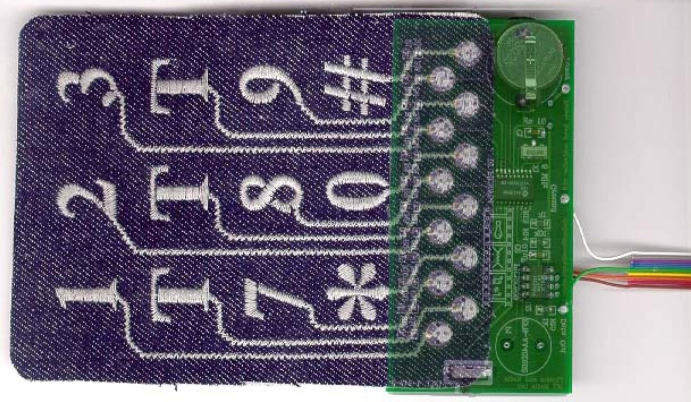
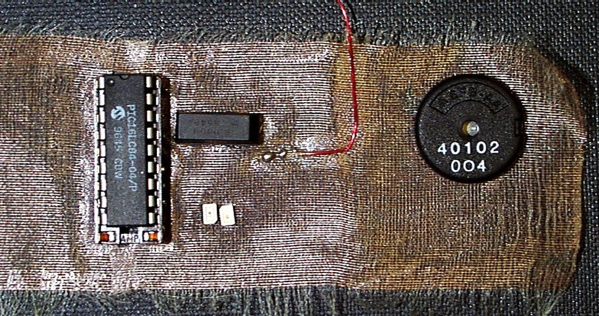
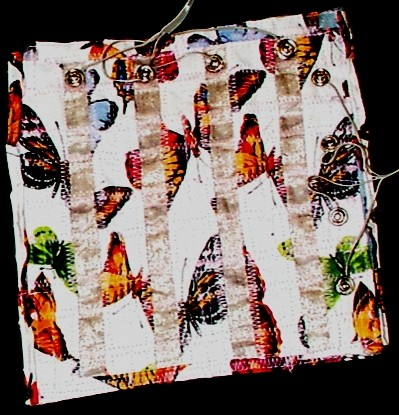

+++
title = "E-broidery"
project_date = "1997–2000"
tags = ["e-textiles", "wearables", "hardware"]
project_thumb = "/assets/thumbnails/wearables-and-textiles/e-broidery/thumb.jpg"
+++

# E-broidery

## Overview

E-broidery is the craft of building electronic circuits *in cloth* — embroidering conductive thread
into fabric with a computer-controlled sewing machine so the stitches themselves carry signal and
power. The same machine that lays down a decorative pattern can lay down wires, electrodes, capacitive
sensors, and data buses, turning an ordinary textile into a soft, washable circuit board. It was the
subject of a master's thesis, *E-broidery: An Infrastructure for Washable Computing*, and of the
flagship paper listed below.

## How it works

- **Stitched conductors.** Conductive threads — metal-wrapped or metal-filled yarns — are embroidered
  along programmed paths, so a single machine pass produces both the look of a pattern and the wiring
  underneath it.
- **Sensors and electrodes in the weave.** Because the conductor is part of the fabric, it can double
  as a capacitive touch pad, a resistive strain sensor, or an electrode for body-coupled signaling —
  with no rigid parts where the cloth needs to flex.
- **Attaching the hard bits.** Chips and components are bonded to the fabric and wired to the
  embroidered traces; **snap fasteners** double as rugged, re-openable electrical connectors between
  panels of cloth.
- **Made to be worn — and washed.** The whole point is a circuit that survives being a garment:
  flexed, crumpled, and laundered.

~~~

  <figure style="margin:0;">
    
    <figcaption style="font-size:0.85rem;color:var(--muted);margin-top:0.4rem;">A "breadboard" woven from conductive cloth — components mounted straight onto the fabric.</figcaption>
  </figure>
  <figure style="margin:0;">
    
    <figcaption style="font-size:0.85rem;color:var(--muted);margin-top:0.4rem;">Snap fasteners as connectors — joining conductive panels mechanically and electrically.</figcaption>
  </figure>

~~~

## Where it led

E-broidery became the fabrication method behind a family of wearable pieces — most visibly the
[Musical MIDI Jacket](/projects/midi-jacket/), whose embroidered keypad (above) plays music at a
touch and which entered the London Science Museum's permanent collection. The work was shown in the
SIGGRAPH '98 Art Gallery and runs through the broader thread of e-textile and wearable work in this
portfolio.

## Publications

- [**E-broidery: Design and Fabrication of Textile-based Computing**](/assets/pdf/post-isj393-part3.pdf),
  E. R. Post, M. Orth, P. Russo, N. Gershenfeld, *IBM Systems Journal* **39**(3–4), 840–860 (2000).
- [**Smart Fabric, or Wearable Clothing**](/assets/pdf/00629937.pdf), E. R. Post, M. Orth,
  *IEEE International Symposium on Wearable Computers (ISWC)*, 1997.
- **E-broidery: An Infrastructure for Washable Computing**, E. R. Post — master's thesis, MIT Media Lab.

## Credits

Developed at the MIT Media Lab with **Maggie Orth**, and with Peter Russo and Neil Gershenfeld.
