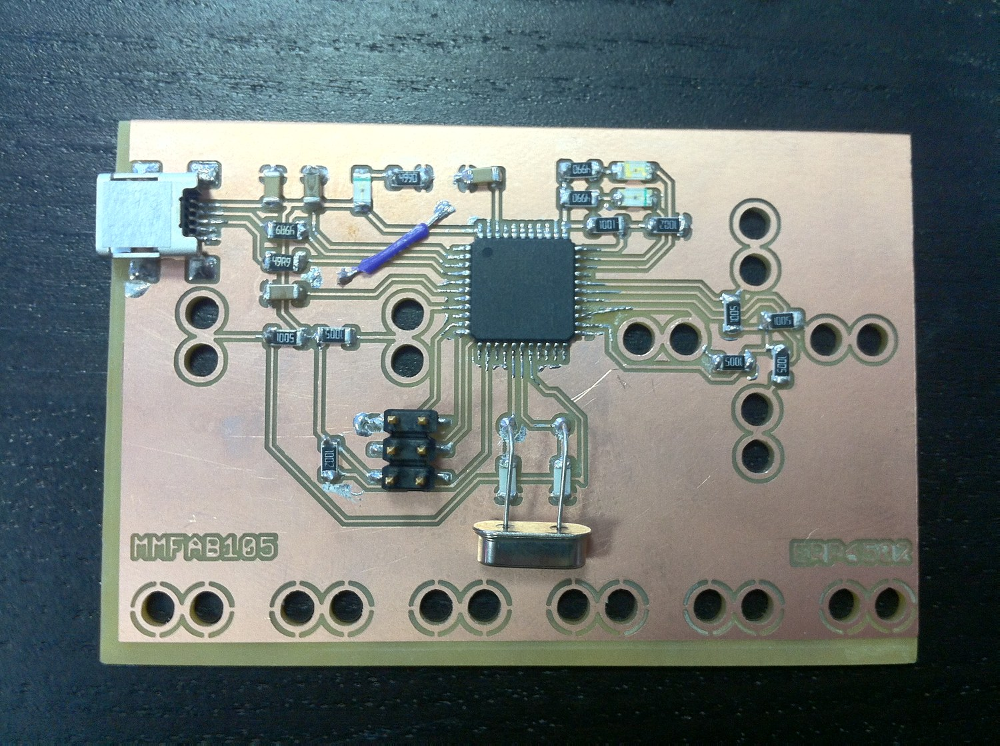
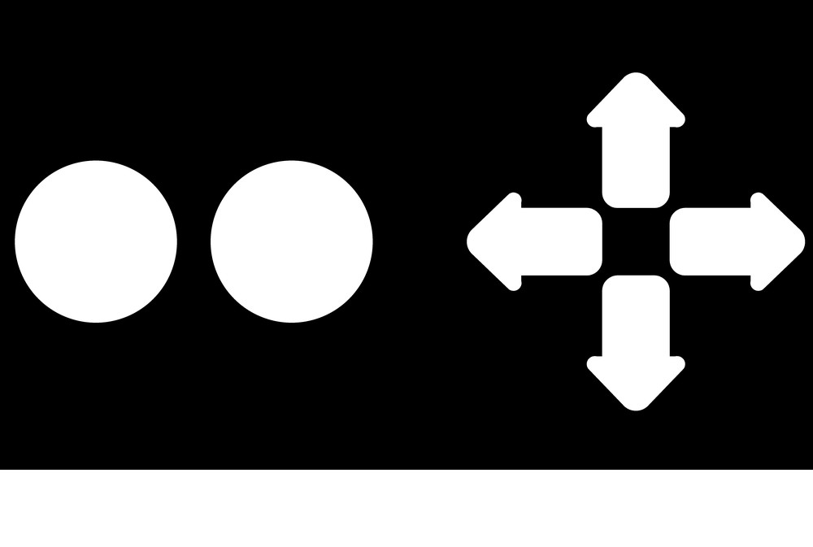

+++
title = "FakeyMakey"
project_date = "2012"
tags = ["interaction", "hardware"]
project_thumb = "/assets/thumbnails/sensors/fakeymakey/thumb.jpg"
+++

# FakeyMakey

## Overview

FakeyMakey (2012) is a hand-fabricated take on the **MaKey MaKey** — the little board that turns
everyday conductive things into computer inputs. Clip a wire to a banana, a doorknob, a pencil
scribble, or a friend's hand, touch it, and the board reports a keypress. The whole thing was made by
**digital fabrication**: the circuit is a single-sided copper board milled in-house (its copper
lettering reads `MMFAB105 / ERP`), populated with a USB microcontroller and a handful of surface-mount
parts.

## How it works

- **A USB input device.** The board carries a USB connector and a microcontroller, so it can present
  itself to a computer as an ordinary keyboard or mouse — every input becomes a normal keystroke or
  click.
- **Clip-on inputs.** The paired "double-ring" pads along the board's edge are the touch inputs, shaped
  to take an alligator clip. In the manner of the MaKey MaKey, each is one side of a switch that closes
  through a very high resistance, so touching almost any conductive object — skin, fruit, graphite —
  registers as an input.
- **Arrow keys and buttons.** The copper-vinyl input artwork lays the pads out as a directional cross
  and a couple of buttons — the arrow keys and clicks needed to drive games and simple interactions.

~~~
<figure style="margin:1.5rem 0;background:#111;border-radius:10px;padding:1.5rem;">
  
  <figcaption style="font-size:0.85rem;color:#aaa;margin-top:0.6rem;text-align:center;">The input layout — clip pads and a directional cross, cut in copper vinyl.</figcaption>
</figure>
~~~

## Fabrication

The board is a **milled copper design** rather than a manufactured PCB: the traces and the double-ring
clip pads were cut directly into copper-clad stock, part of a series of digitally fabricated boards
(the `MMFAB` designator and the `ERP` initials are etched right into the copper).
