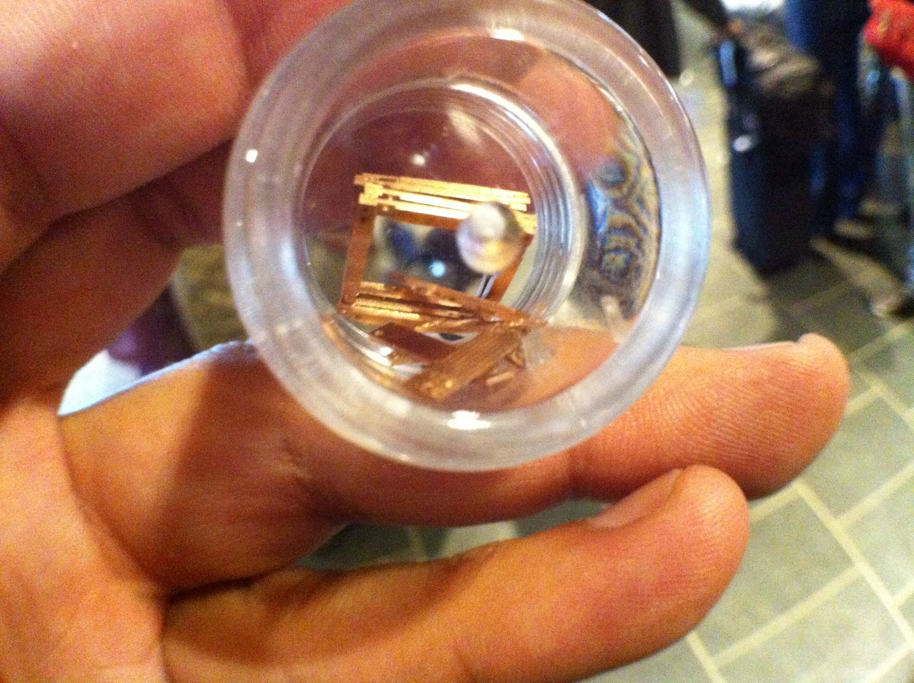
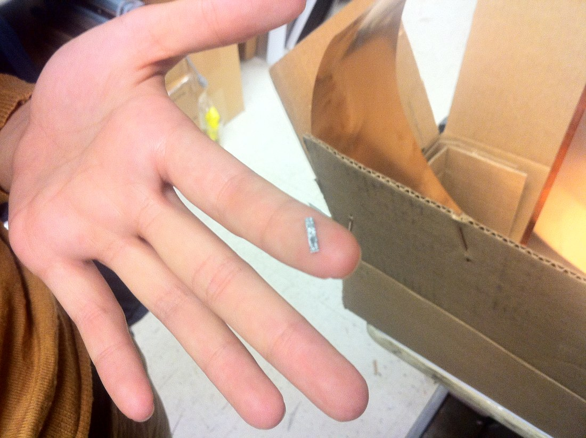

+++
title = "Functional Digital Materials"
project_date = "2009"
tags = ["hardware", "micro-fabrication"]
project_thumb = "/assets/thumbnails/other/functional-digital-materials/thumb.jpg"
+++

# Functional Digital Materials

## Overview

Functional digital materials — informally, "micro legos" — is an exploration of building larger objects
by assembling many small, discrete parts from a limited set of types, the way a digital file is built
from a small alphabet of symbols. Each part is tiny and identical to its kind; snapped together, they
form trusses, lattices, and circuits that can be taken apart and rebuilt. Where casting or machining
shapes a bulk material, digital assembly *places* matter part by part — and because the parts carry
function, the result can conduct or bear load, not just hold a shape.

## The idea

- **A small alphabet of parts.** A handful of interlocking part types, reversibly joined, stand in for
  a continuous material.
- **Assembled, not cast.** Structure comes from how the parts are placed, so the same parts make many
  shapes — and can be disassembled and reused.
- **Function built in.** Conductive and structural parts let an assembly carry signal and load — a step
  toward materials that are also machines.

~~~
<figure style="max-width:520px;margin:1.5rem auto;">
  
  <figcaption style="font-size:0.85rem;color:var(--muted);margin-top:0.5rem;text-align:center;">A single part, at the scale it assembles from.</figcaption>
</figure>
~~~

## Context

This is an early, exploratory piece in the broader digital-materials line of work — the idea that
fabrication itself can be made digital, assembling matter from discrete, reversible parts rather than
shaping it in bulk.
