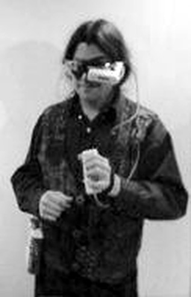

+++
title = "HackMan 0.4"
project_date = "1995–1996"
tags = ["wearables", "computing", "hardware"]
project_thumb = "/assets/thumbnails/wearables-and-textiles/hackman/thumb.svg"
+++

# HackMan 0.4

~~~
<figure style="max-width:270px;margin:2rem auto;text-align:center;">
  
  <figcaption style="font-size:0.85rem;color:var(--muted);margin-top:0.5rem;">The self-built rig, worn — Private Eye display over one eye, Twiddler in hand.</figcaption>
</figure>
~~~

## Overview

> "This is a Linux box that you can carry in a fanny pack."

HackMan 0.4 was a self-built wearable computer, circa 1995–96 — a general-purpose PC
running Linux and DOS, packed into a converted Eagle Creek fanny pack and worn on the body,
driving a heads-up display and typed one-handed. It predates the smartphone era by more than a
decade: a full Linux workstation you carried on your hip and read through a monocle.

## System

The build centered on a 25 MHz Intel 486SL single-board computer (an SMOS CARDIO-486):

| | |
|---|---|
| Operating system | Linux and DOS |
| Engine | 25 MHz Intel 486SL (SMOS CARDIO-486) with FPU |
| Memory | 8 kB cache · 256 kB flash ROM · 8 MB RAM |
| Storage | 1.0 GB 2.5″ Winchester (Quantum Europa 1080 AT) |
| Display | Phoenix Group Private Eye heads-up display |
| Keyboard | HandyKey Twiddler one-handed chording keyboard |
| Power | 6 V sealed lead-acid gel cell (10 W / 4 W / 3 W max/typ/min) |
| Size / weight | 35 × 140 × 180 mm · 615 g without battery, in a steel case |
| Cost | under \$3000 in over-the-counter parts |

Benchmarked over the net by Thad Starner at roughly 12,096 dhrystones/sec and 5 million
whetstones/sec — "about the speed of an SGI 4D/20 or an early Sparc 4/110" — and 12.52 BogoMips
under Linux.

## Hardware hacking

The build was full of period hardware craft:

- The sealed CARDIO-486 module was torn open "to get better coupling for conductive heat
  extraction."
- Hand-modified power management: a 1-farad supercapacitor for CMOS backup, a switching 3.3 V
  regulator swapped in for efficiency, and SMT transistors to power-gate the disk and ISA bus.
- Networking by SLIP over a serial port — limited by the CARDIO's 16450 UARTs (no FIFOs), but
  tuned to about 7.3 kB/s over FTP by adjusting the MTU.
- Powered from the gel cell through a Power Trends switching regulator (and, "sleazy but works,"
  sometimes straight off the cell).

The next revision was planned around a PC/104-less hand-wired bus and a "miniature geek port" — a
PIC microcontroller for generic digital and analog I/O.

## Wearable Waltz

The machine had its own signature demo — a short stop-motion film of the wearable taking itself
apart:

> "You can watch it disassemble itself in the silent classic, *Wearable Waltz*."

~~~
<video controls preload="metadata" style="max-width:100%;border-radius:10px;display:block;margin:2rem auto;">
  <source src="wearable-waltz.mp4" type="video/mp4">
  Your browser does not support the video tag &mdash; <a href="wearable-waltz.mp4">download the clip</a>.
</video>
~~~

## Context

HackMan grew out of a wearable built and worn independently, before the MIT Media Lab — an early,
self-taught arrival at wearable computing. Showing that machine to Thad Starner led to an invitation
to join the Media Lab's wearable-computing group, the "Borgs."

~~~
<!-- MARKER: insert here — the story of meeting Thad Starner (1994), including his invitation email. -->
~~~

For the Media Lab years that followed, see [Wearable Computing](/projects/wearable-computing/). The
original project page dates to the MIT Media Lab, June 1996.
