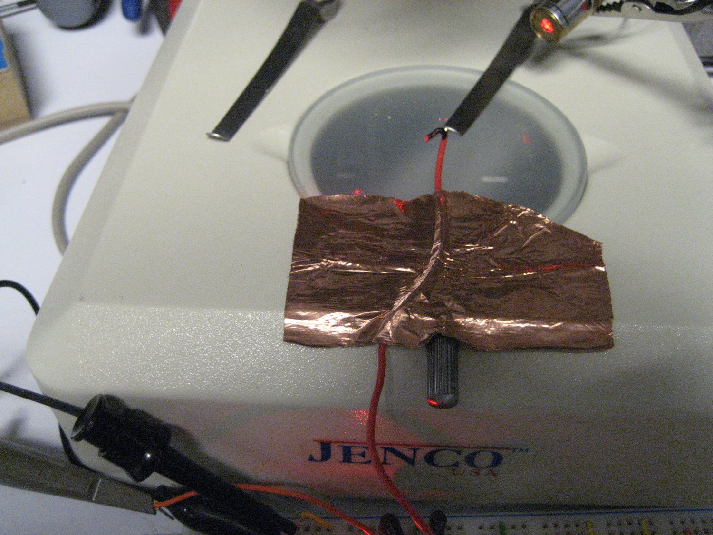
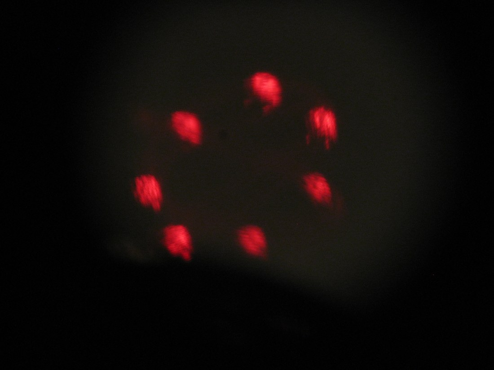
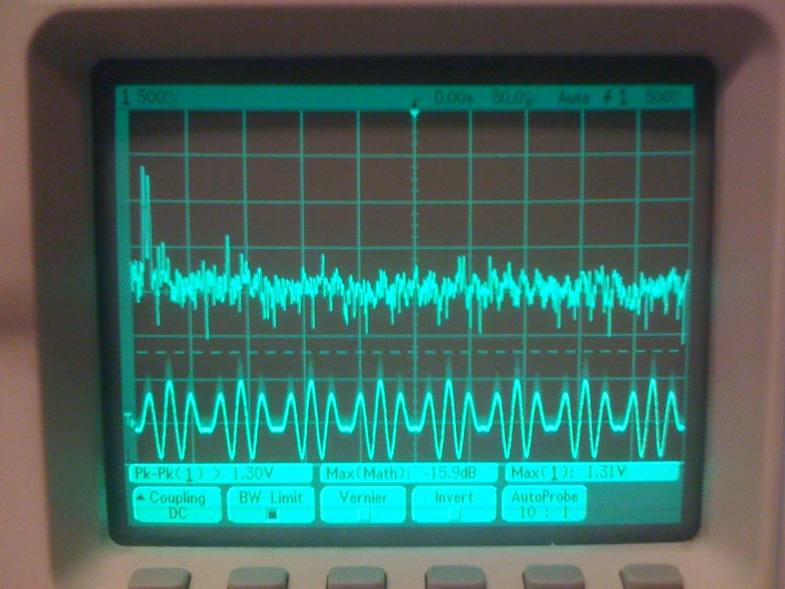

+++
title = "Haltere IMU"
project_date = "2009–2010"
tags = ["inertial-sensing", "sensors"]
project_thumb = "/assets/thumbnails/inertial-sensing/haltere-imu/thumb.jpg"
+++

# Haltere IMU

## Overview

Flies stay upright with **halteres**: a pair of tiny club-shaped organs, evolved from the hindwings,
that beat rapidly during flight. When the body rotates, Coriolis forces deflect the beating halteres
sideways, and mechanoreceptors at their base read that deflection — a biological
**vibrating-structure gyroscope**. The Haltere IMU (2009–2010) is a bench-scale exploration of the
same principle: drive a light structure into steady oscillation, and look for the Coriolis-coupled
motion that appears when it is rotated.

## How a haltere senses rotation

- **Drive.** The structure is held oscillating at its resonant frequency, like the haltere's wingbeat.
- **Coriolis coupling.** Rotating the assembly about an axis perpendicular to that oscillation produces
  a Coriolis force that pushes the structure out of its drive plane, in proportion to the angular rate.
- **Readout.** Sensing that small out-of-plane motion recovers the rotation rate — the same mechanism
  MEMS rate gyros use, here built at a scale you can see and probe by hand.

## The prototype

The bench prototype uses a **thin copper-foil resonator** — the artificial "haltere" — mounted on a
small actuator that drives it into vibration. Its motion is read out **optically**, with a laser
reflected off the foil, while the resonator's electrical signal is watched on an oscilloscope. Working
at macro scale made the drive, the resonance, and the response directly observable before shrinking
the idea toward silicon.

~~~

  <figure style="margin:0;">
    
    <figcaption style="font-size:0.85rem;color:var(--muted);margin-top:0.4rem;">Optical readout — laser light reflected from the vibrating resonator.</figcaption>
  </figure>
  <figure style="margin:0;">
    
    <figcaption style="font-size:0.85rem;color:var(--muted);margin-top:0.4rem;">The driven resonance on the oscilloscope.</figcaption>
  </figure>

~~~

## Context

The Haltere IMU sits alongside other inertial-sensing work in this portfolio that reaches for
unconventional ways to measure motion — the [Particle Trap IMU](/projects/particle-trap-imu/), which
suspends a bead in an electric field, and the [High-Definition IMU](/projects/hd-imu/), which
reconstructs motion from body-worn sensors.
