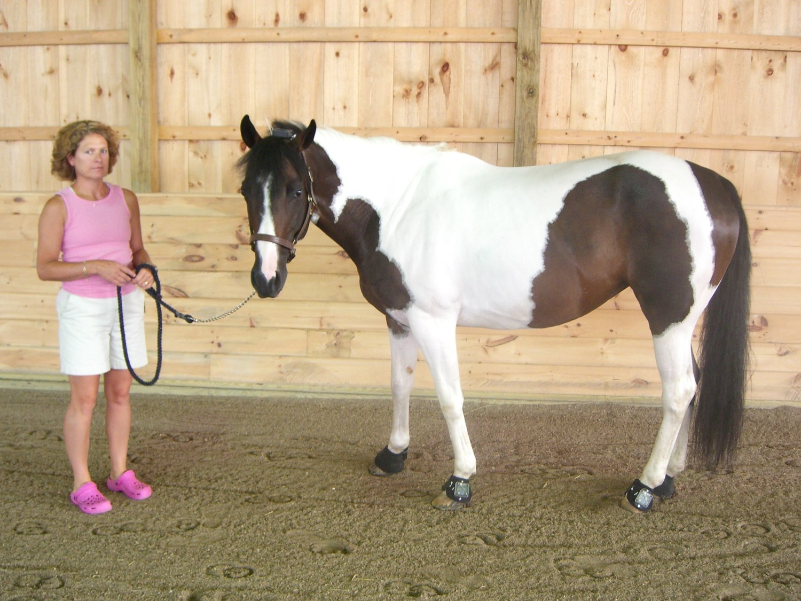
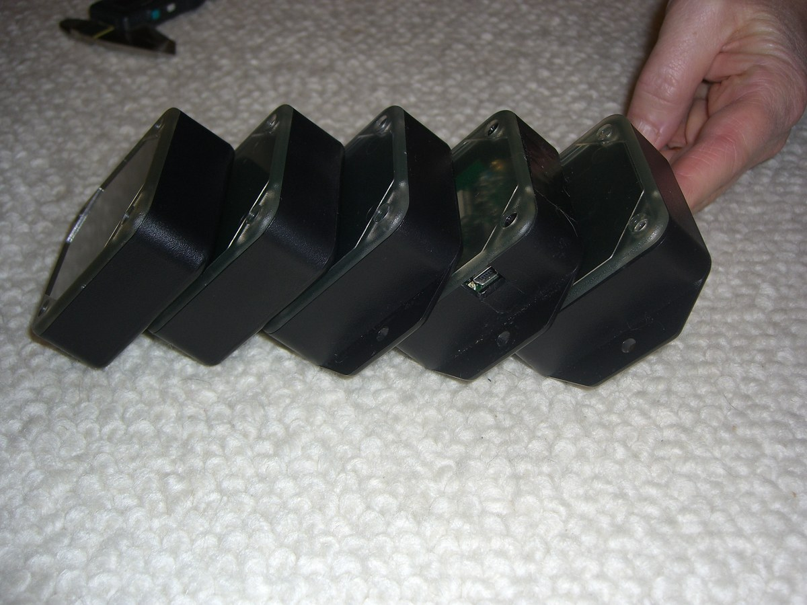
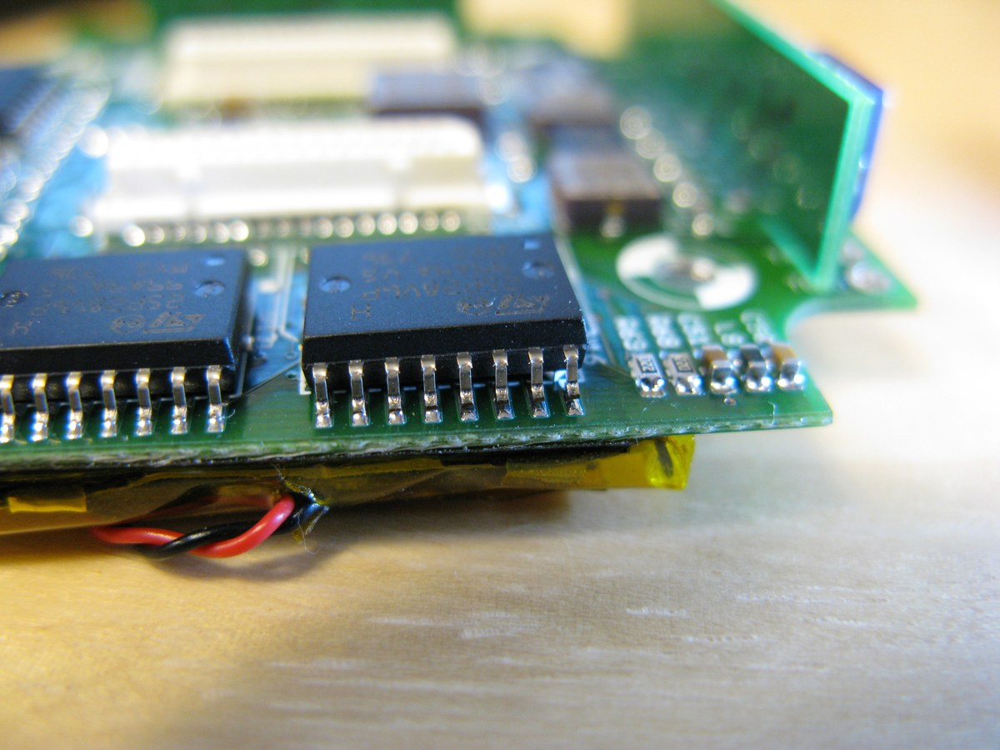

+++
title = "High-Definition IMU"
project_date = "2007–2009"
tags = ["inertial-sensing", "sensors", "wireless"]
project_thumb = "/assets/thumbnails/inertial-sensing/hd-imu/thumb.jpg"
+++

# High-Definition IMU

## Overview

At the engineering company **Asteism**, a hardened, high-resolution, wireless inertial
measurement unit — the *HD IMU* — was developed and carried from concept through prototype to
volume production. Small wireless nodes, each combining acceleration and angular-rate sensing,
attach directly to a moving body; the system captures high-rate motion and reconstructs the
detailed trajectory of each limb through a stride.

The work was applied to **quadruped gait analysis**: nodes on all four limbs of a horse capture
every footfall, and signal processing turns the raw inertial streams into per-stride motion from
which asymmetries in gait can be read.

## The hardware

~~~

  <figure style="margin:0;">
    
    <figcaption style="font-size:0.85rem;color:var(--muted);margin-top:0.4rem;">Hardened, wireless nodes in sealed enclosures — one per limb.</figcaption>
  </figure>
  <figure style="margin:0;">
    
    <figcaption style="font-size:0.85rem;color:var(--muted);margin-top:0.4rem;">Inside a node — multi-axis inertial sensors, flash logging, and battery.</figcaption>
  </figure>

~~~

- **Hardened and wireless.** The nodes were built to survive real-world use on a moving animal —
  rugged enough for the field, wireless so nothing tethers the subject — and taken all the way
  from prototype to volume production.
- **High resolution.** Each node fuses multi-axis acceleration and rotation to resolve the fine
  structure of a footfall, not merely gross motion.

## From raw motion to stride trajectories

Turning noisy, high-rate inertial data from a limb into an accurate stride trajectory is the hard
part: naively double-integrating acceleration accumulates drift almost immediately. Asteism's
signal-processing chain (developed with Jon R. Allen) addressed this with:

- **Automatic segmentation.** The continuous stream is split automatically into individual steps
  and recording sessions — no hand-marking of each footfall.
- **Constrained integration.** The reconstruction is anchored to physical facts about a footfall:
  a hoof's height starts and ends at zero and stays positive through the swing. Priming the
  integration with these constraints (plus per-step bias estimates) keeps the recovered trajectory
  physically plausible instead of drifting away.
- **Robust filtering.** An acceptable-step filter rejects poorly-conditioned strides; across
  trials, **75–90% of automatically segmented steps survived filtering**, and the results were
  robust to errors in where a node sat on the limb.

The output is a clean, per-limb picture of each stride — three-dimensional position and
orientation (yaw, pitch, roll) over time — from which gait metrics and asymmetries can be read.

## Context

The HD IMU sits in a longer thread of inertial-sensing work in this portfolio, alongside the
[Particle Trap IMU](/projects/particle-trap-imu/) and the
[MEMS interferometric accelerometer](/projects/mems-accelerometer/).

## Credits

Developed at Asteism Inc. Signal-processing analysis with Jon R. Allen; the gait-analysis
application was reported with K. Waal ("Detection of Forelimb Lameness Using Inertial Sensor
Data," Asteism Technical Report ATR-01, 2009).
