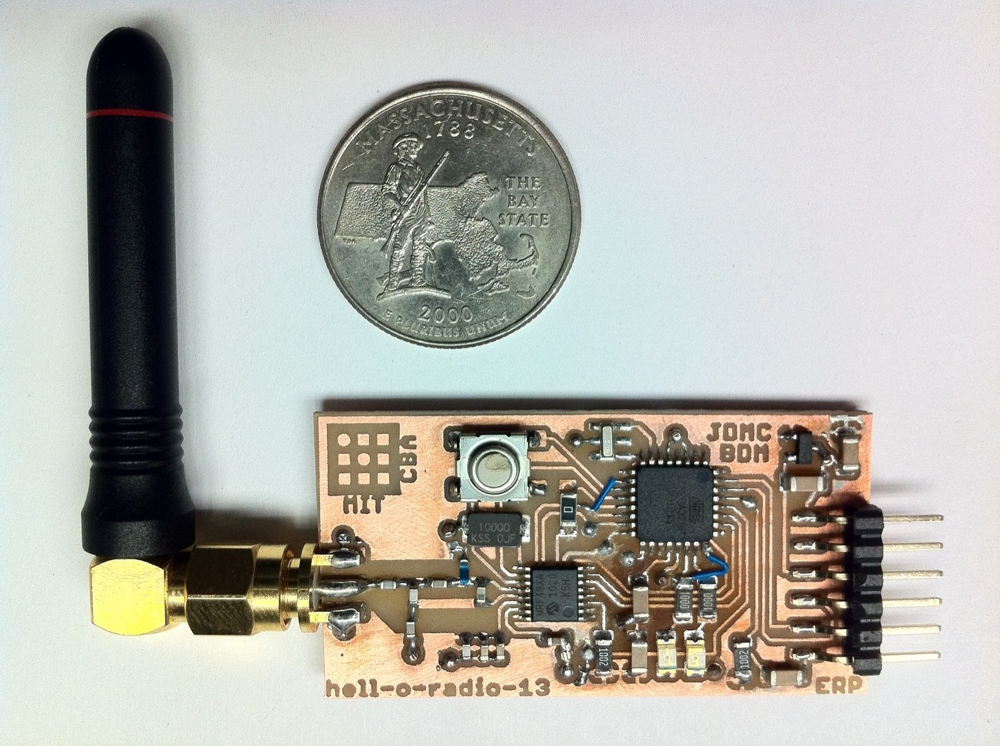
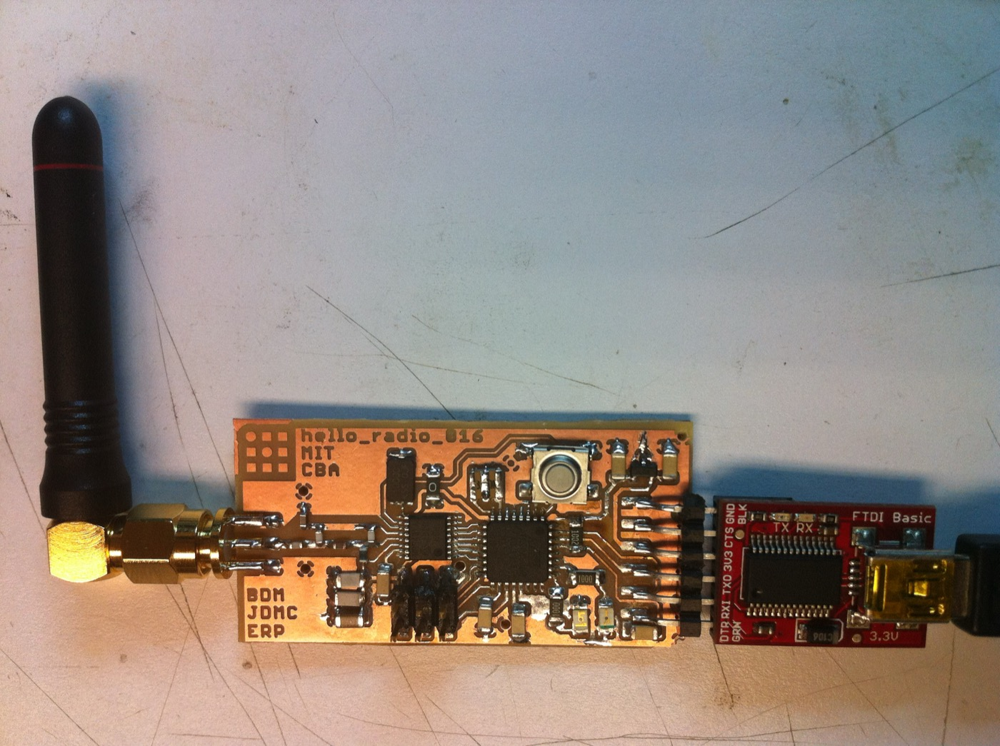
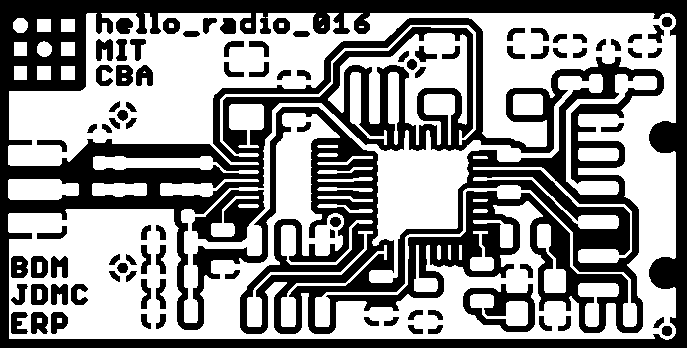
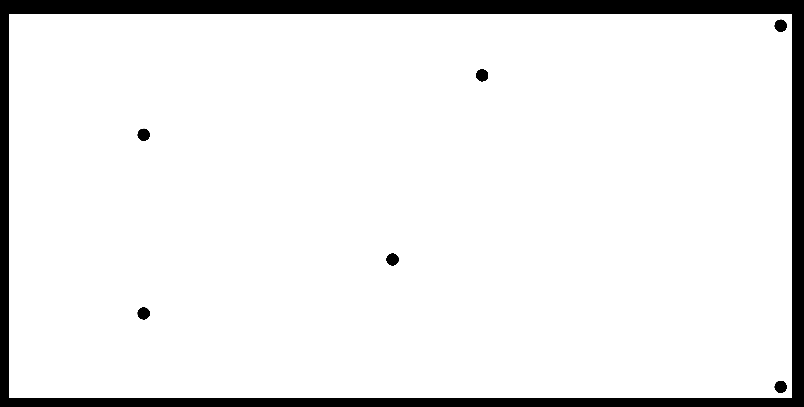

+++
title = "Hello Radio"
project_date = "2009"
tags = ["hardware", "radio", "communication"]
project_thumb = "/assets/thumbnails/other/hello-radio/thumb.jpg"
hascode = true
+++

# Hello Radio



## Overview

Hello Radio is a roughly **\$10 wireless transceiver** — small enough to sit beside a quarter —
built at the MIT [Center for Bits and Atoms](https://cba.mit.edu/) (CBA). For about the price of a
sandwich it reaches data rates up to **256 kbps** and ranges up to **1 km**, bridging the gap between
throwaway hobby radio modules and far more expensive commercial transceivers.

What makes it interesting isn't just the price: the whole board is *digitally fabricated in-house*.
The copper traces are milled on FR4 rather than sent out to a fab, so a working radio can go from
design file to soldered, antenna-equipped board in an afternoon. The maker's marks are milled right
into the copper — the MIT and CBA logos, and the initials of the three people who built it.

## Technical Details

Hello Radio pairs two inexpensive parts:

- An **Atmel ATmega168** 8-bit microcontroller, clocked from a 10 MHz crystal, which runs the
  protocol and talks to a host computer over an **FTDI serial** header.
- A **Microchip MRF49XA** sub-GHz ISM-band transceiver that does the RF work, coupled through a small
  discrete matching network (a handful of 0603 inductors and capacitors) to an **SMA edge connector**
  for an external antenna.

A SOT-23 regulator powers the board, an AVR ISP header allows in-system programming, and two
indicator LEDs plus a tactile switch round out the interface. The complete parts list is short —
around thirty components, all in hand-solderable 1206/0603 packages drawn from CBA's fabrication
libraries.



## Fabrication

Because the board is milled rather than etched or ordered, the design ships as image files ready for
a desktop PCB mill. The signal traces are cut with a 1/64″ end mill, and the through-holes and board
outline with a 1/32″ end mill:



```bash
# Traces (1/64" end mill, 0.38 mm)
png_path hello_radio_016-top.png    hello_radio_016-top.path    1 0.38 4 0.5 0.5
# Holes and outline (1/32" end mill, 0.79 mm)
png_path hello_radio_016-cutout.png hello_radio_016-cutout.path 1 0.79 4 0.5 0.5
```



## Build files

Hello Radio is open hardware. The complete design and firmware for **revision 016** — assembled and
documented by Shelby Doyle — are included here:

- **Schematic** — [PDF](hello_radio_016-sch.pdf) · [EAGLE `.sch`](hello_radio_016.sch)
- **Board** — [PDF](hello_radio_016-brd.pdf) · [EAGLE `.brd`](hello_radio_016.brd) · [library](hello_radio_016.lbr)
- **Assembly diagram** — [PDF](hello_radio_016-assembly.pdf)
- **Bill of materials** — [text](hello_radio_016-bom.txt)
- **Firmware** — [source (C)](hello_radio.c) · [HAL header](hal_hello_radio-016.h) · [Makefile](makefile) · [compiled `.hex`](hello_radio.hex)
- **Bootloader** — [ATmega168 @ 8 MHz](ATmegaBOOT_168_pro_8MHz.hex)

## Credits

Hello Radio was developed by **Brian Mayton, David Cranor, and Rehmi Post** at the MIT Center for
Bits and Atoms. Revision 016 was assembled and documented by Shelby Doyle.
