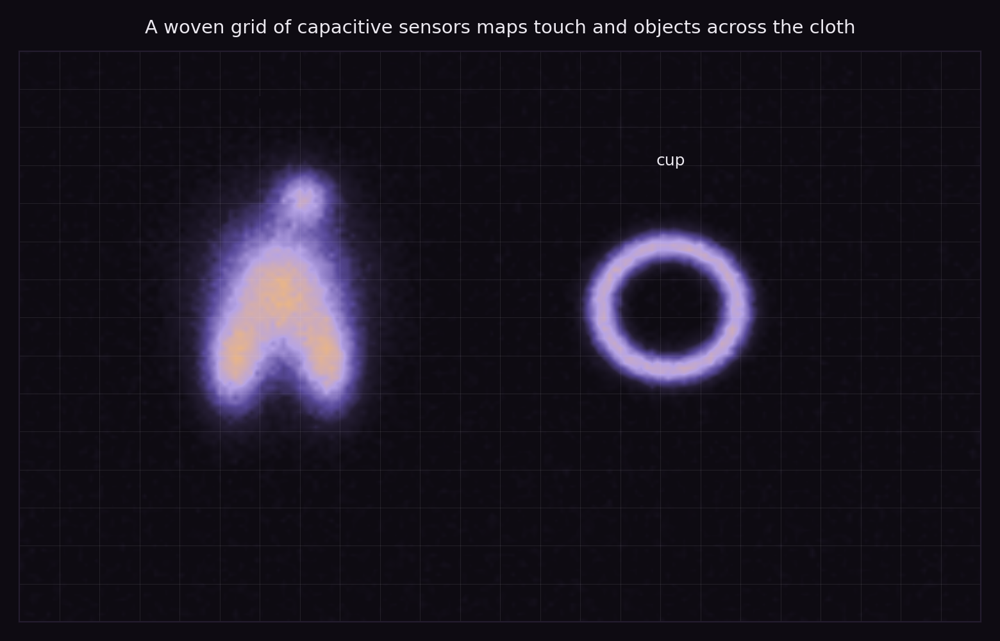
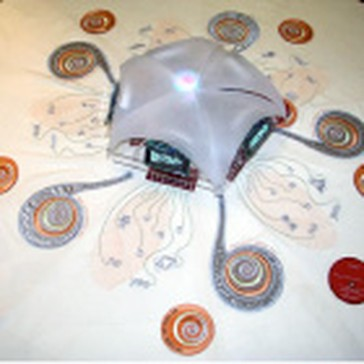

+++
title = "Interactive Tablecloth"
project_date = "2009"
tags = ["e-textiles", "interaction", "sensors"]
project_thumb = "/assets/thumbnails/wearables-and-textiles/interactive-tablecloth/thumb.jpg"
+++

# Interactive Tablecloth

## Overview

The Interactive Tablecloth (2009) turns an ordinary table covering into a sensing surface. Conductive
thread woven and printed into the cloth forms an array of spiral capacitive sensors, so the fabric can
feel where it is touched and where objects rest on it — a hand, a cup, a plate — with no rigid
electronics on top. It extends the [e-broidery](/projects/e-broidery/) approach from wiring toward
whole-surface sensing.

## How it senses

- **Spiral sensor coils.** Electrodes distributed across the cloth each read the capacitance of whatever
  is near — a finger, or a grounded object — while a small module at the centre gathers their readings.
- **Touch and objects.** Combined, the coils give a low-resolution map of what is on the table:
  contact, presence, and the footprint of objects placed on it.
- **Still a tablecloth.** The sensing is woven in, so the surface stays soft, drapable, and washable.

~~~
<figure style="max-width:300px;margin:1.5rem auto;">
  
  <figcaption style="font-size:0.85rem;color:var(--muted);margin-top:0.5rem;text-align:center;">The cloth itself — spiral sensor coils around a central readout module (archival photo).</figcaption>
</figure>
~~~

## Context

A companion to the other e-textile work in this portfolio — [e-broidery](/projects/e-broidery/),
[µTartan](/projects/utartan/), and the gesture-sensing [multitouch table](/projects/taufish/) — all
surfaces that sense.
