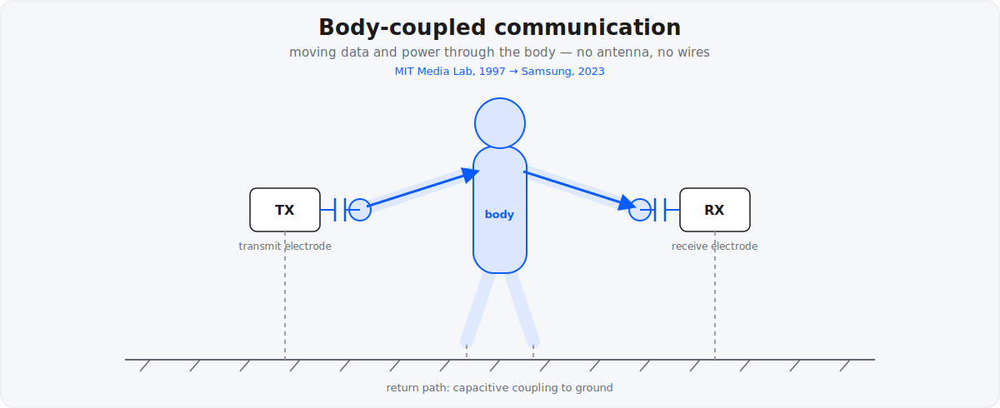

+++
title = "Intrabody Networking"
project_date = "1997–2023"
tags = ["intrabody", "wearables", "communication"]
project_thumb = "/assets/thumbnails/other/intrabody-power/thumb.svg"
+++

# Intrabody Networking

## Overview

The human body is a surprisingly good medium for moving small amounts of power and data.
By capacitively coupling a signal into the body, a wearable can communicate with — or
even power — another device through contact or proximity, with no radio and no wires. The
signal travels through the body from a transmit electrode to a receive electrode and returns
through a capacitive path to ground.

Rehmi Post has worked this idea across more than two decades, from its origins at the MIT
Media Lab to a modern physical-layer design at Samsung — a rare "one researcher, one idea"
throughline.

## The body-coupled bus (MIT, 1997)

At the MIT Media Lab, Post and colleagues built intrabody *buses* that carried both data and
power through the body via capacitive coupling — including a handshake-triggered "interbody"
exchange when two people touch.

- **Paper:** E. R. Post, M. Reynolds, M. Gray, J. Paradiso, N. Gershenfeld,
  "Intrabody Buses for Data and Power," *1st International Symposium on Wearable Computers
  (ISWC)*, 1997, pp. 52–55.
- **Patent:** [US6211799 — Method and Apparatus for Transbody Transmission of Power and
  Information](https://patents.google.com/patent/US6211799B1) (MIT; filed 1997, granted 2001).
  Capacitive coupling transmits data and power through the human body, with a
  handshake-triggered exchange between bodies.

## An efficient physical layer (Samsung, 2020→2023)

Two decades later, at Samsung Research America, Post returned to the same medium with a modern
communications treatment: an efficient physical layer for intrabody networks that encodes input
data into spreading codes mapped onto frequency subcarriers, transmitted through the body via
capacitively coupled electrodes.

- **Patent:** [US11700069 — Efficient Physical Layer for Intrabody Communication
  Networks](https://patents.google.com/patent/US11700069B2) (Samsung; filed 2020, granted 2023;
  sole inventor).

The span from the 1997 ISWC paper to the 2020-filed Samsung patent is a roughly 23-year arc —
the same core insight (use the body itself as the wire), revisited with the tools of a new era.

## Why it matters

Body-coupled communication needs no antenna and radiates very little, so it is inherently
low-power and comparatively private — signals stay close to the body rather than broadcasting
into the room. That makes it attractive for wearables, medical and implantable devices, and
secure "touch-to-exchange" interactions.

## Patents

- [US6211799 — Transbody Transmission of Power and Information](https://patents.google.com/patent/US6211799B1) (2001)
- [US11700069 — Efficient Physical Layer for Intrabody Communication Networks](https://patents.google.com/patent/US11700069B2) (2023)

See the [patents page](/PATENTS/) for the complete portfolio.
