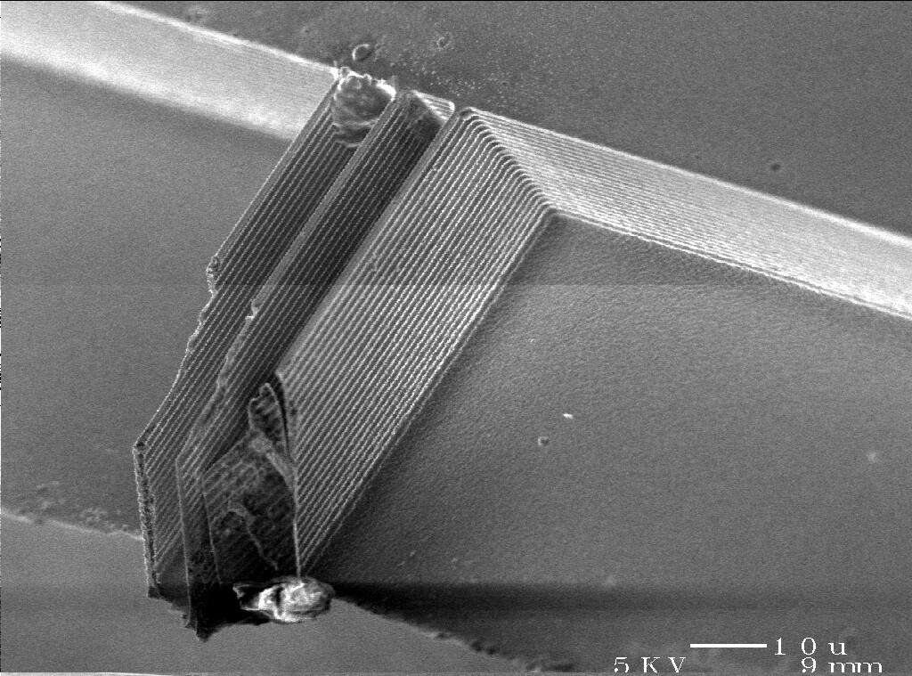
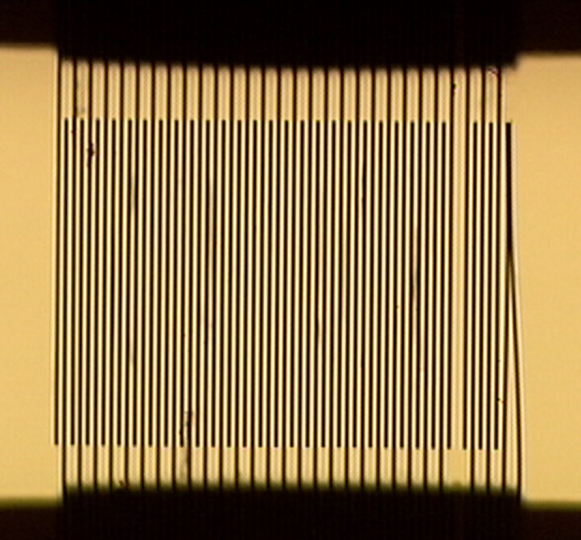
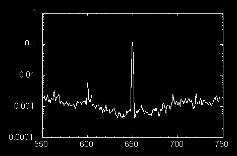

+++
title = "MEMS Interferometric Accelerometer"
project_date = "Fall 1999"
tags = ["inertial-sensing", "sensors", "micro-fabrication"]
project_thumb = "/assets/thumbnails/inertial-sensing/mems-accelerometer/thumb.jpg"
+++

# MEMS Interferometric Accelerometer

## Overview

This is a microfabricated accelerometer that reads acceleration *optically* rather than
electrically. Instead of measuring a change in capacitance, it measures the tiny motion of a proof
mass with a laser and a diffraction grating built into the device itself — a technique that reaches
microgravity sensitivity from a simple two-mask silicon process, with no precision optics and no
feedback electronics.

## How it works

The heart of the sensor is a set of interleaved reflective fingers, attached alternately to a
cantilevered proof mass and to the fixed support frame. Together they form an optical
**diffraction grating**. When the grating is lit with coherent light from an ordinary laser diode,
it splits the beam into a fan of diffracted spots; the intensity of each spot depends on how far the
proof-mass fingers have moved relative to the frame. The zeroth-order beam varies as cos²(2πz/λ)
with the displacement z, so a single photodiode watching one spot turns sub-ångström motion into a
voltage.

Because both reflecting surfaces sit on the same chip, alignment is forgiving — the readout is a
laser diode and a photodetector a few centimetres away, nothing more. The interdigital sensing
scheme was borrowed from the interferometric atomic-force-microscope cantilever, which had already
shown displacement resolution well below 0.01 Å.

## Fabrication

The device is made with a **two-mask process** on a double-side-polished ⟨100⟩ silicon wafer. A
front-side deep reactive-ion etch (DRIE) defines the fingers and the cantilever — fingers about 2 µm
wide at a 10:1 aspect ratio — and a second, backside DRIE releases the proof mass. The finished
cantilever measures roughly 2100 × 1000 × 20 µm and carries a 1000 × 1000 × 500 µm proof mass. There
is no buried etch stop, so the backside etch is timed; carrier stress cracked the delicate finger
combs on most attempts, which is why an intact device like the one above is worth photographing.

## Performance

The released device rang at a mechanical resonance near 906 Hz. Driven with a piezo actuator, a
170 µg calibration tone at 650 Hz produced a photodiode signal standing about 100:1 above the noise
floor — a measured resolution of **1.7 µg/√Hz**. The published figure is **2 µg/√Hz in a 1 Hz band
centred at 650 Hz**, six orders of magnitude below the acceleration of gravity.

~~~
<figure style="max-width:520px;margin:2rem auto;">
  
  <figcaption style="font-size:0.85rem;color:var(--muted);margin-top:0.5rem;">Measured frequency response — photodiode signal (log scale) versus frequency in Hz. The spike at 650 Hz is the 170 µg calibration tone, ~100:1 above the noise.</figcaption>
</figure>
~~~

The estimated thermal-mechanical noise of the structure was only about 90 ng/√Hz, so the device was
limited by detection and environmental noise rather than by the physics of the proof mass — meaning
there was headroom to do better. At this resolution it matched electron-tunnelling accelerometers of
the day, but with a far simpler process, no feedback control, and optics small enough to package in
under 10 cm³. The same interdigital readout lends itself to arrays of differential sensors.

The work grew out of a Fall 1999 graduate project (MAS.965) at the MIT Media Lab, fabricated in the
MIT Microsystems Technology Laboratory.

## Publication

[**High-resolution micromachined interferometric accelerometer**](cooper_APL_2000.pdf),
E. B. Cooper, E. R. Post, S. Griffith, J. Levitan, C. F. Quate, S. R. Manalis,
*Applied Physics Letters* **76**(22), 3316–3318 (2000),
[doi:10.1063/1.126637](https://doi.org/10.1063/1.126637).

## Credits

Emily Cooper, Rehmi Post, Saul Griffith, Jeremy Levitan, Calvin F. Quate, and Scott Manalis, with
fabrication support from the MIT Microsystems Technology Laboratory (Martin Schmidt, Vicky Diadiuk,
Tom Takacs) and Tom Kenny and Calvin Quate at Stanford. Supported in part by the Things That Think
consortium.

## Related Work

- [Particle Trap IMU](/projects/particle-trap-imu/)
- [Haltere IMU](/projects/haltere-imu/)
