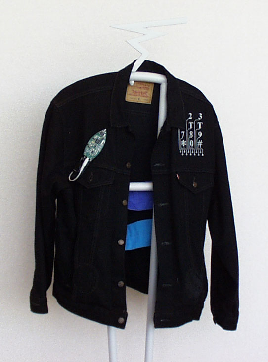

+++
title = "MIDI Jacket"
project_date = "1997"
tags = ["wearables", "e-textiles", "music", "interfaces"]
project_thumb = "/assets/thumbnails/wearables-and-textiles/midi-jacket/thumb.jpg"
+++

# MIDI Jacket

## Overview

Computing will only be truly "wearable" when it finally disappears into the fabric of everyday life.

## Project Description

It is perhaps safe to say that the majority of society will always wear clothing. Textiles are one of the earliest technologies, serving many functions: affording protection from the environment, defining the wearer's identity, and providing places to carry objects.

However, the electronic gear that makes this information revolution possible still takes an awkward form. It's not truly wearable except in the sense that it will fit in your pocket or strap onto your body. The goal of this work is to integrate technology directly into clothing by replacing circuit boards with fabric circuitry and packaging components for assembly into fabric circuits.

## Innovation

The MIDI Jacket represents one of the earliest attempts to create truly integrated wearable electronics by incorporating the circuitry directly into the fabric itself. This approach moves beyond simply attaching electronic components to clothing and instead makes the garment itself an active part of the electronic system.