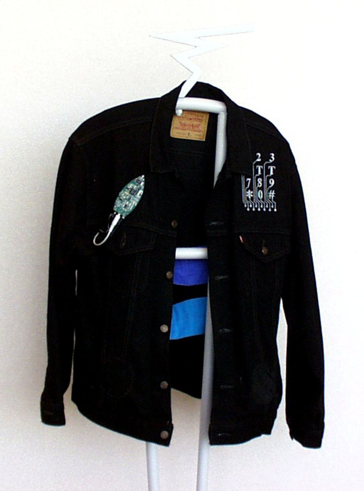
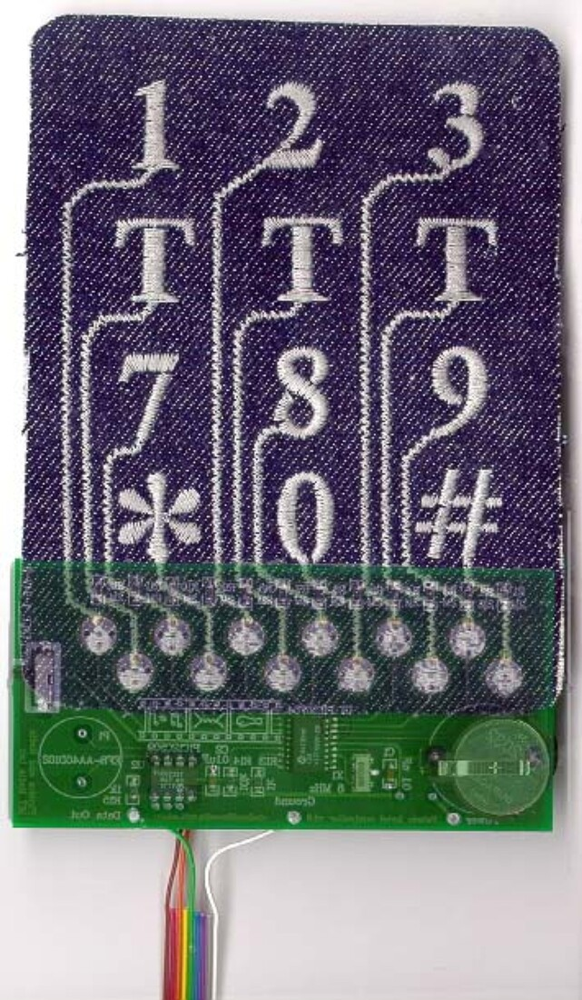

+++
title = "Musical MIDI Jacket"
project_date = "1997"
tags = ["wearables", "e-textiles", "music"]
project_thumb = "/assets/thumbnails/wearables-and-textiles/midi-jacket/thumb.jpg"
+++

# Musical MIDI Jacket

## Overview

The Musical MIDI Jacket is an ordinary Levi's denim jacket with a musical keypad sewn directly into
it. The keys — a twelve-key pad stitched on the chest — are embroidered in conductive thread;
touching them plays notes through a small MIDI synthesizer carried on the garment. There is no rigid
keyboard and no obvious electronics: the instrument *is* the cloth.

It was the flagship demonstration of [E-broidery](/projects/e-broidery/), the method of building
circuits by embroidering conductive thread with a computer-controlled sewing machine. The jacket was
among the first pieces to show that off-the-shelf conductive threads and fabrics could serve at once
as sensors, as electrical interconnect, and as decoration in a garment someone could actually wear.

## How it works

- **An embroidered keypad.** The keypad is stitched in mildly conductive thread. Each stitched key is
  a capacitive electrode — it senses the touch of a finger, read through a single I/O pin — and the
  same embroidery pass that forms the visible pattern also lays down the wiring beneath it.
- **From touch to note.** A small printed circuit board at the base of the pattern does the
  capacitive sensing and **outputs keypresses as a serial data stream**; that stream drives a
  **miniature MIDI synthesizer**, which sounds the corresponding note. The keypad is polyphonic — several
  notes can sound at once — and the audio plays through miniature speakers set into the jacket's
  pockets, the whole system weighing under a pound.
- **Made to be worn.** Because the conductors are part of the fabric, the garment keeps the drape and
  durability of clothing — no circuit board to snap, nothing rigid where the cloth needs to bend.

~~~
<figure style="max-width:360px;margin:2rem auto;">
  
  <figcaption style="font-size:0.85rem;color:var(--muted);margin-top:0.5rem;">The keypad up close — embroidered keys, their traces running to the capacitive-sensing board and its "Data Out" ribbon.</figcaption>
</figure>
~~~

The pattern was not a one-off: in a test run, **fifty denim jackets were embroidered** with this
keypad using ordinary industrial embroidery and conductive thread, and some were fitted with the
miniature MIDI synthesizer so the jacket could be played.

## Exhibitions and collection

The Musical MIDI Jacket was shown widely as a public face of wearable computing and e-textiles:

- **MIT Media Lab Wearable Fashion Show** — October 1997
- **SIGGRAPH '98 Art Gallery** — July 1998, alongside the Firefly Electronic Dress and Necklace
- **Science Museum, London** — on permanent loan to the Museum's Wellcome Wing (the digital-technology galleries that opened in 2000)
- **Künstlerhaus, Vienna** — April–August 2000
- **Museum of Science, Boston** — Spring 2001
- **Innoventions, Walt Disney World** (Orlando) — a special version made for permanent exhibition

## Where it led

The approach matured over the following decade into [j4k3t 2.0](/projects/j4k3t-20/) (2006) — the same
sew-your-own musical interface, made smaller, more refined, and still buildable with a sewing machine
and a soldering iron.

## Publications

- [**Musical jacket**](https://doi.org/10.1145/281388.281456), M. Orth, J. R. Smith, E. R. Post,
  J. A. Strickon, E. B. Cooper, *ACM SIGGRAPH 98 Electronic Art and Animation Catalog*, 1998.
- [**Smart Fabric, or Wearable Clothing**](/assets/pdf/00629937.pdf), E. R. Post, M. Orth,
  *IEEE International Symposium on Wearable Computers (ISWC)*, 1997.
- Project page: [MIT Media Lab, Opera of the Future — *Musical Jacket*](https://opera.media.mit.edu/projects/jacket.html).
- Context: [MIT Media Lab — *Things That Think* consortium (1995–2014)](https://www.media.mit.edu/groups/things-that-think/overview/).

## Credits

Made in the MIT Media Lab's **Opera of the Future** group (directed by Tod Machover) and **Physics and
Media** group (directed by Neil Gershenfeld). The embroidered fabric keypad and its capacitive sensing
were developed by **Rehmi Post**, **Maggie Orth**, and **Emily Cooper**; the miniature MIDI synthesizer
was built by **Josh R. Smith** and **Joshua Strickon**. The work was built on the
[E-broidery](/projects/e-broidery/) fabric-circuit method.

Both groups were part of the Media Lab's **Things That Think** consortium (1995–2014) — the sponsor
research program co-directed by Neil Gershenfeld, Michael Hawley, and Tod Machover, which gathered some
forty companies and more than twenty research groups (among them Physics and Media, Opera of the Future,
and Tangible Media) around moving computation out of conventional computers and into everyday things.
