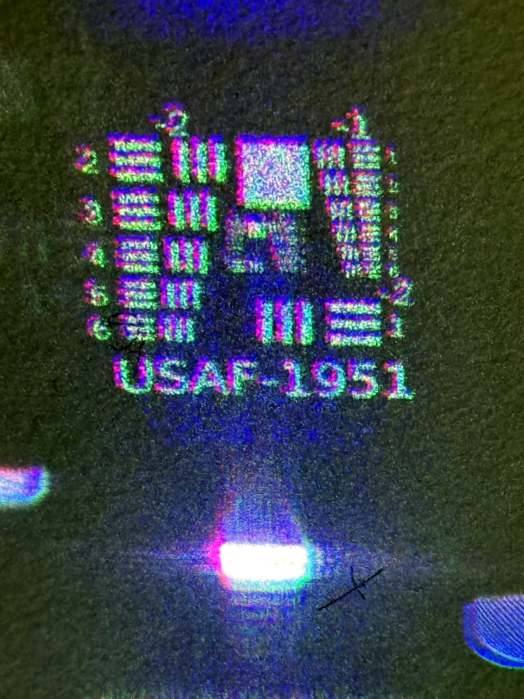
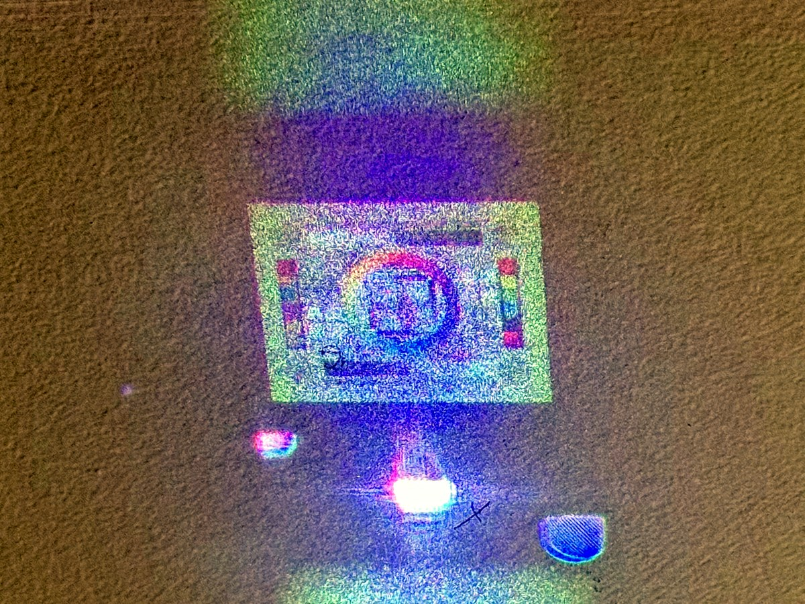

+++
title = "OpenFINCH"
project_date = "2022–2024"
tags = ["optics", "computational-imaging"]
project_thumb = "/assets/thumbnails/other/openfinch/thumb.jpg"
+++

# OpenFINCH

## Overview

OpenFINCH is an open-source platform for computational holography — forming and reconstructing images
with a spatial light modulator (SLM) and computation rather than glass optics, built from cheap,
off-the-shelf hardware and open software. The name nods to **Fresnel incoherent correlation holography
(FINCH)**, a way to record holograms of ordinary, incoherently-lit scenes. The stated goal is plain:
build an optics research lab for pennies on the dollar.

## What it does

- **Holography with an SLM.** A spatial light modulator shapes the wavefront, so images are formed by
  diffraction and computation instead of lenses — the reconstructions here are of a color chart and a
  USAF-1951 resolution target, projected from computed holograms.
- **Open hardware and software.** The system is driven by two open-source projects:
  [OpenFinch.jl](https://github.com/rehmi/OpenFinch.jl) (the Julia control and reconstruction stack)
  and [SLM-VERA](https://github.com/rehmi/SLM-VERA) (spatial-light-modulator control).
- **Cheap on purpose.** The aim is accessibility — an incoherent-holography setup from affordable
  parts, so computational optics is something to tinker with, not only to buy.

~~~
<figure style="margin:1.5rem 0;">
  
  <figcaption style="font-size:0.85rem;color:var(--muted);margin-top:0.5rem;text-align:center;">A color test chart, reconstructed from a computed hologram.</figcaption>
</figure>
~~~

## Watch

~~~

<iframe src="https://www.youtube.com/embed/D_FzqtEK6oA" frameborder="0" allow="accelerometer; autoplay; clipboard-write; encrypted-media; gyroscope; picture-in-picture" allowfullscreen></iframe>

~~~

## Links

- [OpenFinch.jl](https://github.com/rehmi/OpenFinch.jl) — control and reconstruction software (Julia)
- [SLM-VERA](https://github.com/rehmi/SLM-VERA) — spatial light modulator control
- Presented at **OpenSauce 2024**.
