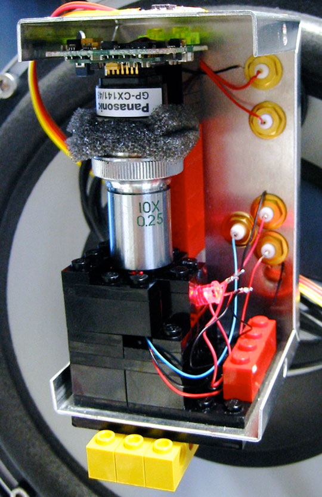
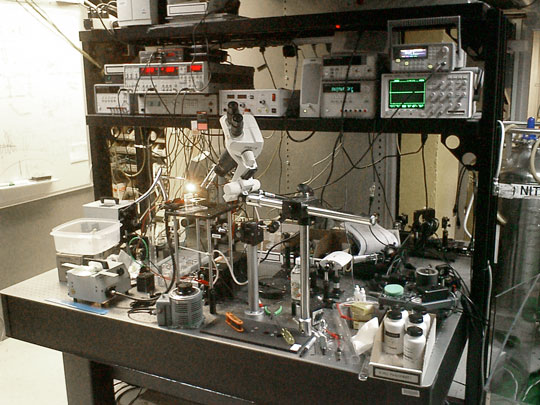

+++
title = "Particle Trap IMU"
project_date = "2003"
tags = ["inertial-sensing", "sensors", "physics", "PhD"]
project_thumb = "/assets/thumbnails/inertial-sensing/particle-trap-imu/thumb.jpg"
+++

# Particle Trap IMU

## Overview

Miniature motion sensors are everywhere these days, detecting the orientation of cell phones, deploying air bags in cars and measuring stresses in buildings and mechanical systems. But manufacturing the sensors' tiny moving parts requires the same high-tech, billion-dollar facilities that churn out computer chips.

## Innovation

For my PhD, I developed a sensor consisting of a tiny metal bead suspended in a hole drilled in a circuit board. A fluctuating electric field holds the bead aloft in a tight orbit, and disturbances of the orbit indicate the sensor's direction of motion and rotation. This sensor opens the door to a new class of miniaturized devices that exploit the dynamics of simple physical systems instead of the mechanical interactions of precisely micromachined parts.

Such "microdynamical" devices could enable cheaper, simpler, more responsive sensors for a range of applications, including the measurement of sound, pressure, fluid-flow and magnetic fields.

## Technical Details

This device can do the work of at least six different micromechanical sensors. It can measure acceleration in three dimensions, which would ordinarily require three accelerometers. But it can also gauge orientation, which would usually require an additional three gyroscopes.

At the sensor's heart is a particle trap, a device commonly used in experimental physics. Physically, the trap is very simple: two metal plates on either side of a circuit board, with a hole about the diameter of an electrical wire drilled through them. But a computer circuit hooked up to the plates exerts precise control over the electric field they produce.

## Working Principle

The electric field can be thought of as saddle-shaped:
- Front to back, it curves upward at the ends
- Side to side, it curves downward
- The field fluctuates as if it were rotating

A particle at its center is like a marble on a warped turntable. The marble starts to roll down one of the downward slopes, but the turntable revolves, and the marble finds itself rolling up an uphill slope instead. When it falls back down the slope, it repeats the whole process on the opposite side of the turntable, and so on.

A particle in the trap is thus not perfectly still but rapidly oscillating as, in effect, it rolls back and forth between upward slopes. Each of the six types of motion detected by a complete set of accelerometers and gyros disturbs the particle in a distinctive way.

## Impact

As noted by Michael Judy, a researcher at Analog Devices (the company that built the Wii's accelerometers): "If [we] can get all six degrees out of it, it would be huge. That's the holy grail right now in the human interface to electronics." 

The technology has significant potential applications in navigation in environments where GPS information is either unreliable or too imprecise. For instance, local spatial tracking would let hospital workers immediately determine each other's locations, even on different floors of a large building.