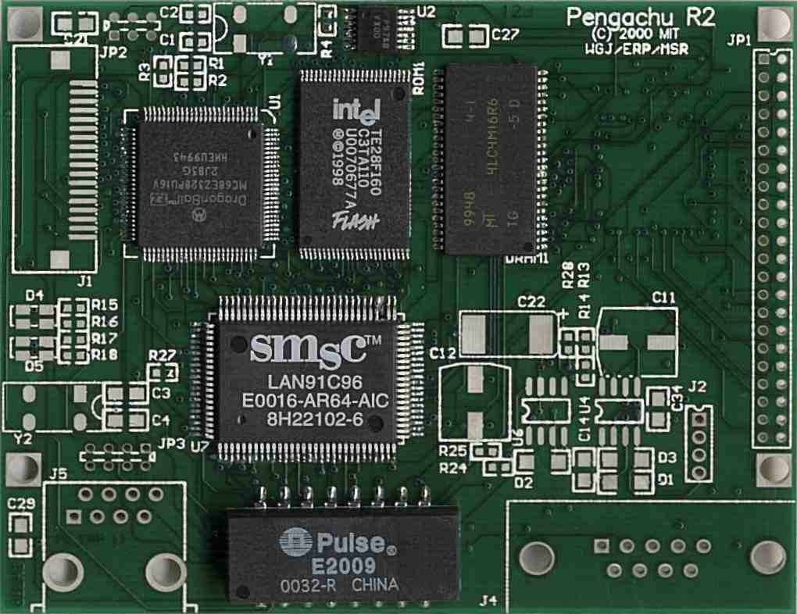
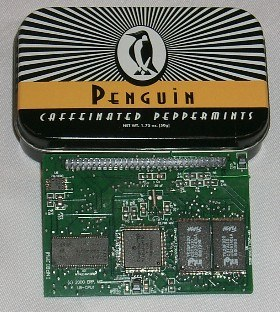
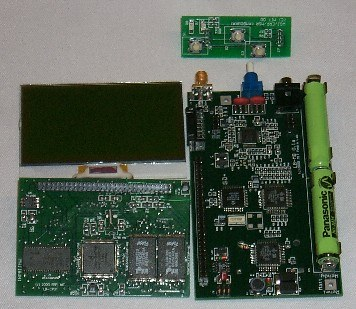
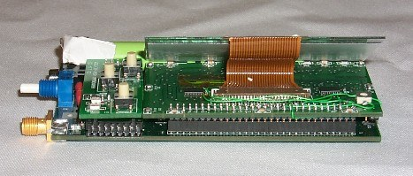

+++
title = "Pengachu"
project_date = "2000–2001"
tags = ["hardware", "computing", "wireless"]
project_thumb = "/assets/thumbnails/other/pengachu/thumb.jpg"
+++

# Pengachu

## Overview

**Pengachu** — *"a cheap wireless Linux palmtop for everyone"* — was a 2000–2001 MIT Media Lab
project to build a pocket-sized, fully open Linux computer years before such a thing was common.
Well before the OLPC or the Raspberry Pi, Pengachu aimed at a sub-\$50, hackable handheld with
peer-to-peer wireless networking, pointed squarely at education and use in "infrastructure-poor
places."

It was built by **Wendy Ju, Rehmi Post, and Matt Reynolds** — three equal contributors — in a
two-month "little skunkworks" crash-development sprint, and shown at the Media Lab's *Things That
Think* consortium meeting. About the size of a tin of mints:

## Design goals

- Small, cheap, and long battery life
- Peer-to-peer ad-hoc wireless TCP/IP networking
- Open software (GPL) and open hardware — no license fees
- A complete software development environment *on board*: vi, emacs, C, and Scheme
- A reusable module set that other embedded projects could build on

## System architecture

Pengachu was organized as four reusable modules that could be mixed and matched:

- **Processor core** — a Motorola DragonBall CPU with 8 MB of flash and 8 MB of DRAM, running Linux.
- **Mothercard** — an audio DSP, a 200 kbit/s TDMA/FDMA data radio, the backplane-bus controller, and
  up to 64 MB of removable flash.
- **User-interface board** — a removable front panel with a 128×64 LCD, buttons, and a scroll wheel.
- **Docking station** — battery charging and wired connectivity.

The boards talked over a deliberately cheap backplane — a 1 Mbps SPI bus rather than anything exotic.
Aggressive power management let it decode MP3s on roughly **50 mW**, and the entire software stack —
web browser, full TCP/IP suite, NFS, a web server, plus the on-board compilers — fit in **under
1 MB**.

## Two flavors

The same core spawned two boards. The **Pengachu PDA** ran from two AAA NiMH cells, driving a 128×64
(or 320×240) LCD with a PIC16LF877 as its housekeeping controller. The **Pengachu Server** — the
board shown at the top — added 10-BaseT Ethernet, CompactFlash/IDE storage, and, in one variant, a
Xilinx 30k-gate FPGA behind a reconfigurable 40-pin user port, so it could serve its own web pages
and take on "arbitrarily complicated custom stuff."

## Networking

Everything was peer-to-peer and standards-based (TCP/IP). A **900 MHz, 1 mW, 200 kbps** radio handled
the wireless LAN — either ad-hoc peering or hub-and-spoke gateways to the internet — while a 1 Mbps
multidrop **RS-485** link covered the wired case (Ethernet was judged too power-hungry, and Cat-5 too
expensive, for the target). A device could move between connected and detached modes freely.

## Context

Pengachu grew out of the Media Lab's interest in ubiquitous, reconfigurable computing and drew on a
library of freely reusable FPGA IP cores that Rehmi maintained. Its mix of open hardware, open
software, cheap wireless networking, and an education-first mission reads today like a preview of the
low-cost-computing-for-everyone projects that arrived years later.

*Project Pengachu — Wendy Ju, Rehmi Post, and Matt Reynolds. MIT Media Lab, 2000–2001.*
