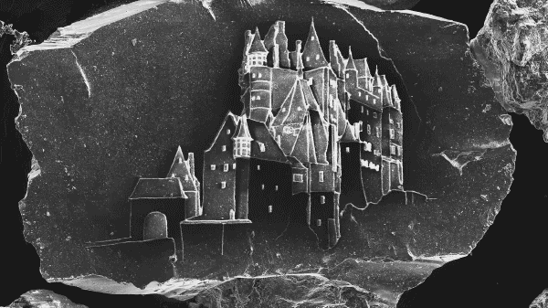
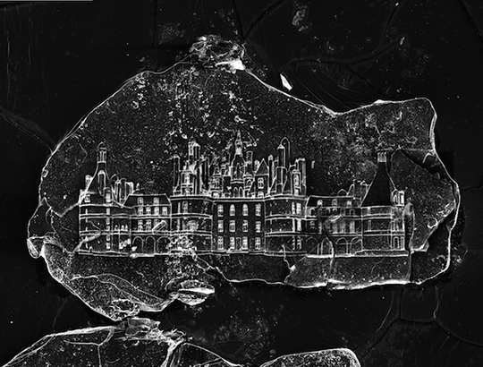
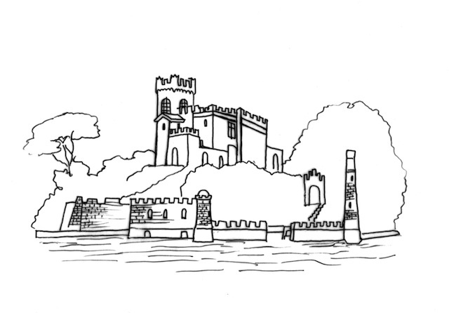
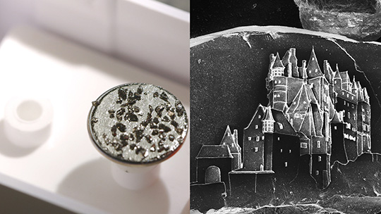
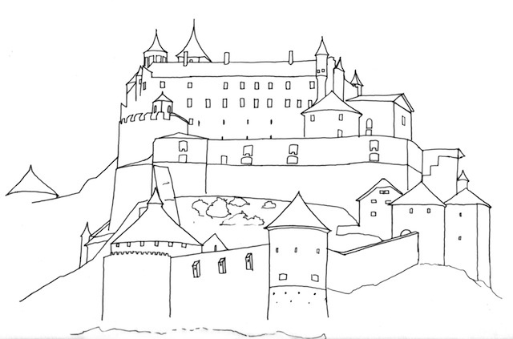
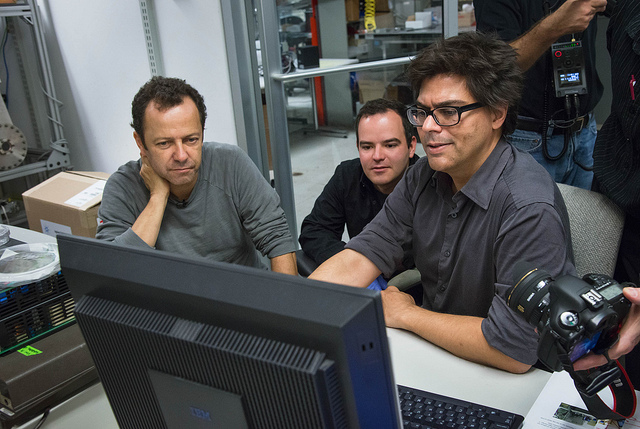
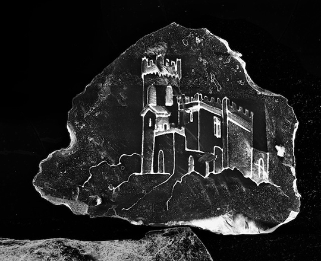
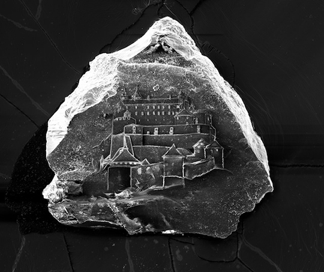
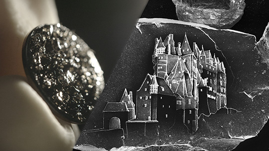
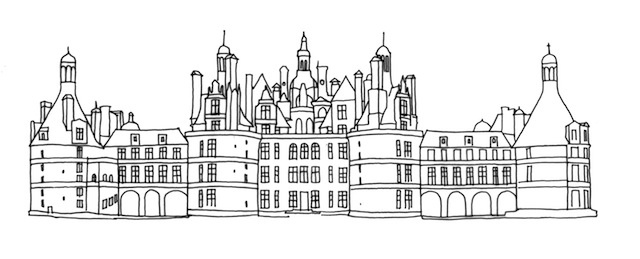

+++
title = "Sandcastles"
project_date = "2010-2012"
tags = ["micro-fabrication", "art"]
project_thumb = "/assets/thumbnails/other/sandcastles-thumb.jpg"
+++

# Sandcastles

## Overview

A sandcastle is ordinarily built from many grains of sand. These are the reverse: castles drawn by the artist Vik Muniz and etched onto single grains — the castle smaller than the grain. Getting there, with Muniz, Marcelo Coelho, and our team, took four years of trial and error.

## How they were made

Muniz drew the castles with a camera lucida — an optical superimposition device dating to 1807 that projects the scene in front of the viewer onto a sheet of paper, so it can be traced by hand. The drawings then came to our team to be put onto sand.

Several writing processes failed first. Laser inscription often destroyed the softer grains outright, and on harder grains left too faint a mark to read. What finally worked was a focused ion beam (FIB) microscope — an instrument ordinarily used to repair integrated circuits — run gently enough to draw on a grain of sand. The FIB works on two screens at once: one images the grain with electrons, the other steers the ions that do the etching. The result is a crisp castle at the scale of the grain.

## Gallery

## Additional Resources

[View the Flickr album of Vik's visit to MIT](https://flic.kr/s/aHsjE4mnZx)