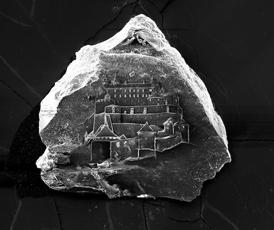

+++
title = "Sandcastles"
project_date = "2010-2012"
tags = ["art", "microscopy", "collaboration"]
project_thumb = "/assets/thumbnails/other/sandcastles-thumb.jpg"
+++

# Sandcastles

## Overview

After four years of trial-and-error experimentation, artist Vik Muniz and artist/researcher Marcelo Coelho successfully created drawings as tiny as they are tremendous: magnificent castles etched onto microscopic grains of sand—a complete and innovative reversal of building a sand castle.

## Technical Details

To achieve these etchings, Muniz worked with Coelho and Rehmi Post to devise a highly technical process involving both antiquated technology and innovative visual tools. Muniz first created sketches of castles using a camera lucida, an optical superimposition device created in 1807 that turns images in front of the viewer into a projection on piece of paper, allowing him to trace the tiny castles.

Next, he sent these drawings to Coelho and Post, who tried several microscopic drawing processes for several years with limited successes. Laser-inscription, for example, often destroyed the soft sand, or wouldn't appear distinct enough on harder grains. Finally, they settled on a Focused Ion Beam (FIB) microscope, a device typically used for fixing integrated circuits on microchips, at highly-sensitive levels to yield the shape of a castle at a microscopic scale.

The FIB uses two screens: the first frames the image, depicting the electrons needed to see the grain. The second screen displays the ions which etch the grain, resulting in a crisp image of Muniz's castles.

## Gallery

## Additional Resources

[View the Flickr album of Vik's visit to MIT](https://flic.kr/s/aHsjE4mnZx)