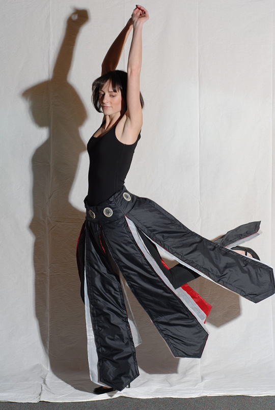

+++
title = "Sp4rkl3"
project_date = "Jan 2008"
tags = ["wearables", "energy-harvesting", "e-textiles", "fashion"]
project_thumb = "/assets/thumbnails/wearables-and-textiles/sparkle/thumb.jpg"
+++

# Sp4rkl3

## Overview

Sp4rkl3 is an innovative dress that creates its own light show powered entirely by the wearer's movement. As the skirt moves and sways, it generates electricity that powers LED illumination, creating a dynamic display that responds to the wearer's activity level. The design contains no batteries, instead utilizing a novel power generation mechanism that creates a dazzling effect while keeping the electronics virtually invisible.

## Technical Innovation

The dress demonstrates a new approach to wearable power generation, harvesting electrostatic energy from natural movement. This technology not only powers the LED display but also serves as a visible gauge of the wearer's motion level, encouraging physical activity through an immediate visual feedback loop.

## Publications

1. **[Electrostatic Power Harvesting for Material Computing](pdf/sp4rkl3-PUC-11.pdf)**  
   E. R. Post, K. Waal  
   Personal and Ubiquitous Computing, v. 15 no. 2 pp. 115-121 (2011)  
   [doi:10.1007/s00779-010-0313-9](http://dx.doi.org/10.1007/s00779-010-0313-9)  
   **[Invited Paper]**

2. **[Electrostatic Power Harvesting in Textiles](pdf/ElectrostaticPowerHarvesting.pdf)**  
   E. R. Post, K. Waal  
   Proc. ESA Annual Meeting on Electrostatics 2010, Paper G1

## Patents

- [US8519677 - Electrostatic power harvesting for material computing](http://www.google.com/patents/US8519677)

## Press Coverage

- [SEAMLESS v.3 - Computational Couture](http://seamless.sigtronica.org/projects.html)
- [Boston Globe Fashion Section](http://www.boston.com/lifestyle/fashion/gallery/stylespy2708?pg=21)
- [New Scientist: LED-studded skirt makes a bright fashion statement](http://www.newscientist.com/article/mg20727765.500-ledstudded-skirt-makes-a-bright-fashion-statement.html)
- [Ask Alexia: LED clothing - Sp4rkl3 skirt lights you up with electric charges produced through rubbing](http://askalexia.com/2010/09/07/led-clothing-sp4rkl3-skirt-lights-you-up-while-electric-charges-produced-through-rubbing/)
- [The Point News: MIT Researcher Explains Science Through Fashion](http://thepointnews.com/2010/09/mit-researcher-explains-science-through-fashion)

## Team

Created by Kit Waal and Rehmi Post