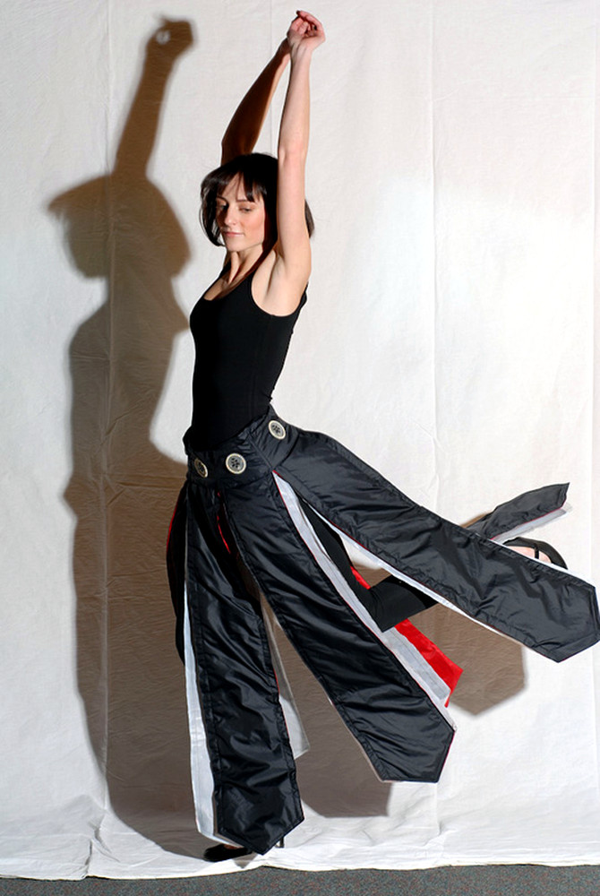

+++
title = "Sp4rkl3"
project_date = "Jan 2008"
tags = ["wearables", "e-textiles", "art"]
project_thumb = "/assets/thumbnails/wearables-and-textiles/sparkle/thumb.jpg"
+++

# Sp4rkl3

## Overview

Sp4rkl3 is a light-emitting skirt powered entirely by the wearer's own motion. As the skirt moves and sways, its layers of fabric come into contact and separate; that contact generates a triboelectric charge, which is harvested to drive the skirt's LEDs. There are no batteries — the display is powered by the same movement it responds to, and the electronics stay all but invisible in the cloth.

## Technical Innovation

The skirt demonstrates triboelectric power harvesting in a textile: the charge produced when dissimilar fabrics touch and part is collected and used directly, so the LED display also reads as a gauge of how much the wearer is moving. The mechanism is documented in the publications below (electrostatic power harvesting in textiles), and it is the same contact-electrification physics later turned to sensing in [TriboTouch](/projects/tribotouch/).

## Publications

1. **[Electrostatic Power Harvesting for Material Computing](pdf/sp4rkl3-PUC-11.pdf)**  
   E. R. Post, K. Waal  
   Personal and Ubiquitous Computing, v. 15 no. 2 pp. 115-121 (2011)  
   [doi:10.1007/s00779-010-0313-9](http://dx.doi.org/10.1007/s00779-010-0313-9)  
   **[Invited Paper]**

2. **[Electrostatic Power Harvesting in Textiles](pdf/ElectrostaticPowerHarvesting.pdf)**  
   E. R. Post, K. Waal  
   Proc. ESA Annual Meeting on Electrostatics 2010, Paper G1

## Patents

- [US8519677 - Electrostatic power harvesting for material computing](http://www.google.com/patents/US8519677)

## Press Coverage

- [SEAMLESS v.3 - Computational Couture](http://seamless.sigtronica.org/projects.html)
- [Boston Globe Fashion Section](http://www.boston.com/lifestyle/fashion/gallery/stylespy2708?pg=21)
- [New Scientist: LED-studded skirt makes a bright fashion statement](http://www.newscientist.com/article/mg20727765.500-ledstudded-skirt-makes-a-bright-fashion-statement.html)
- [Ask Alexia: LED clothing - Sp4rkl3 skirt lights you up with electric charges produced through rubbing](http://askalexia.com/2010/09/07/led-clothing-sp4rkl3-skirt-lights-you-up-while-electric-charges-produced-through-rubbing/)
- [The Point News: MIT Researcher Explains Science Through Fashion](http://thepointnews.com/2010/09/mit-researcher-explains-science-through-fashion)

## Team

Created by Kit Waal and Rehmi Post