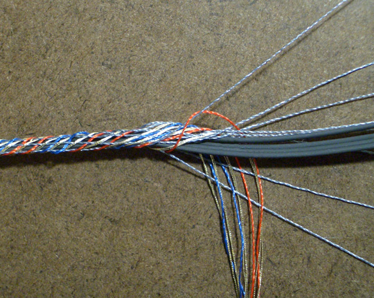
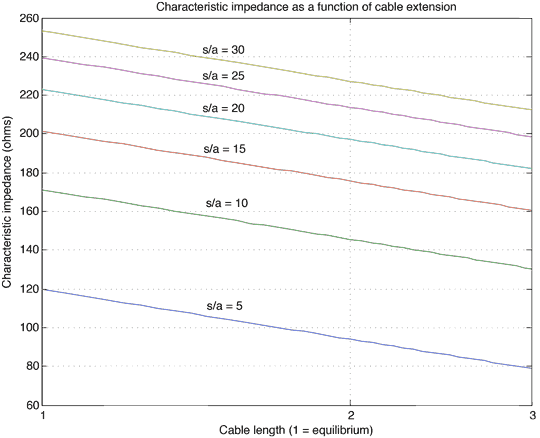
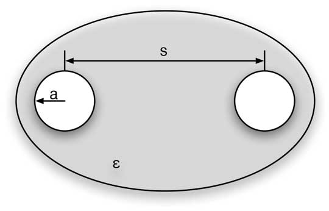
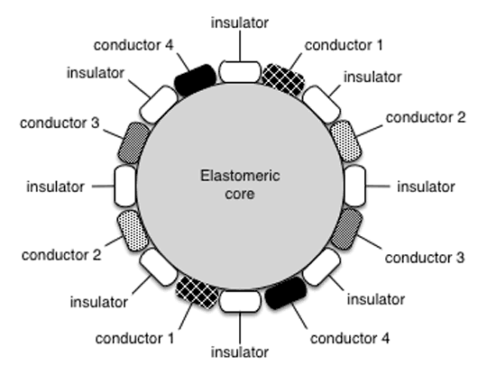
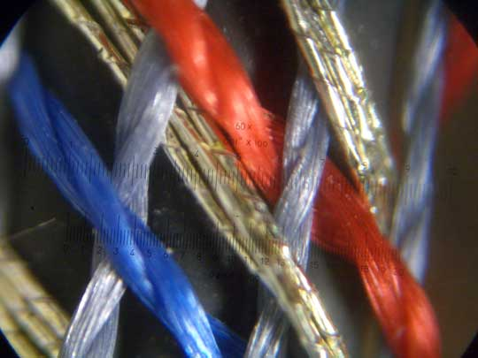
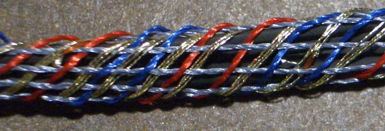
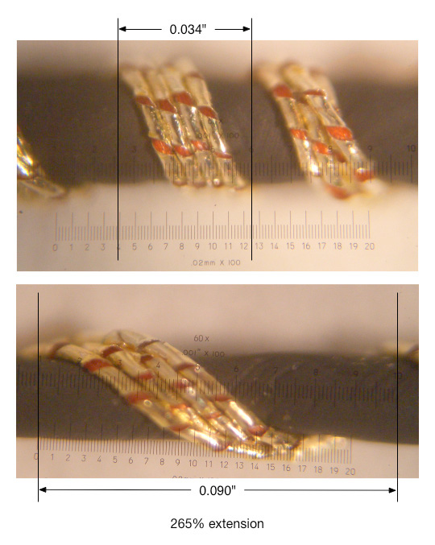
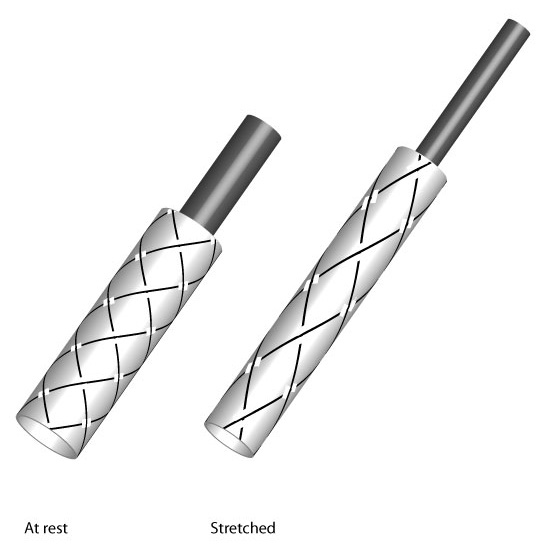

+++
title = "Stretchable Cable"
project_date = "2005, Sep"
tags = ["e-textiles", "electronics", "materials", "wearables"]
project_thumb = "/assets/thumbnails/wearables-and-textiles/stretchable-cable/thumb.jpg"
+++

# Stretchable Cable

## Overview

We demonstrate how to arrange non-elastic elements (wires, fibers, etc.) in a geometry that can extend to several times its resting length. This can be achieved using existing braiding techniques and materials, eliminating the need for specialized materials or equipment.

## Technical Innovation

The resistance of this cable remains constant when stretched, unlike other elastic conductors whose resistance is a bulk or surface property. Since the conducting fiber does not itself stretch, the basic properties of the wire do not change as the braid is stretched.

## Technical Details

### Multiple Conductor Configurations
- We can use multiple distinct, adjacent conductors and alternating conductors to form transmission lines with predictable impedance
- Twisted pairs can be incorporated to increase noise immunity
- When a braid containing a balanced transmission line is stretched, the spacing between conductors decreases, and so does the characteristic impedance of the transmission line

### Structure and Implementation
- The structure can be a single conductor forming a helical wrap around the inner elastomer, without opposing elements
- Conductors can be woven into the braid in parallel to form a stretchable ribbon cable
- The braid permits definition of transmission line structures:
  - Twisted pair is formed in the same braid and stays positioned by nature of the braid
  - As the braid is stretched, the characteristic impedance changes predictably
  - By sensing the change in impedance, drive electronics can compensate and determine degree of extension

## Applications

While braided conductors are already used in cable manufacturing, they haven't previously been employed as structures for extensible electrical interconnects. Traditional applications use individual strands as electrically parallel conductors:
- In braided shielding: uninsulated conductors form an effective shield at uniform electrical potential
- In Litz wire: insulated conductors form distinct but parallel paths for high-frequency, high-current signals

## Advanced Features

- An adaptive impedance matching network can be included at each end to provide proper termination and compensate for variation of transmission line impedance as the braid is stretched
- Optical fibers may be incorporated into the braid

## Credits

Project by Rehmi Post and Kit Waal