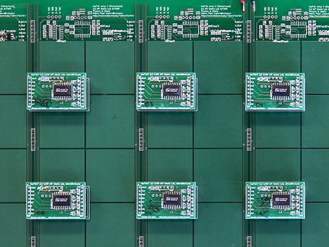
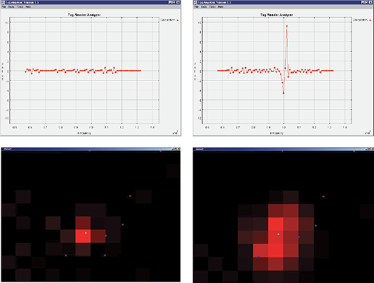
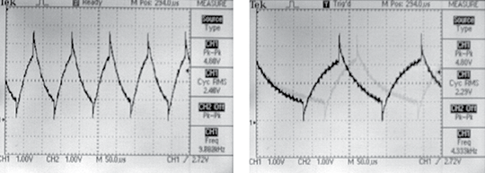
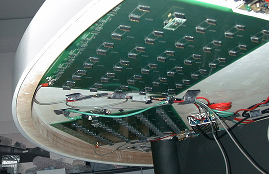
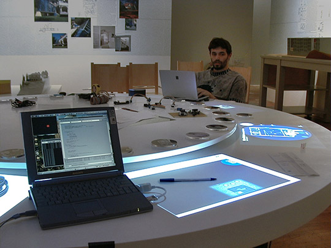
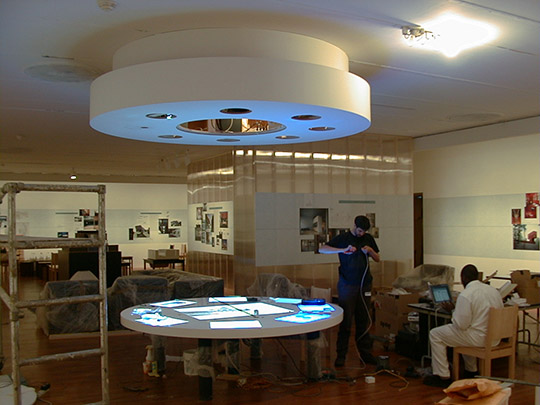
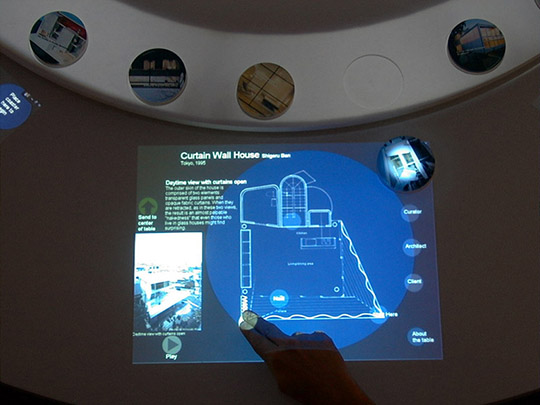

+++
title = "Multitouch Table at MoMA"
project_date = "1999"
tags = ["sensors", "multitouch", "museum", "interaction"]
project_thumb = "/assets/thumbnails/sensors/taufish/thumb.jpg"
+++

# Multitouch Table at MoMA

## Overview

An interactive multitouch table developed in cooperation with the Museum of Modern Art (MoMA) New York for the ["Un-Private House" exhibition](http://www.moma.org/interactives/exhibitions/1999/un-privatehouse/credits.html) in 1999.

## Technical Details

For this interactive multitouch table, I developed a sophisticated sensing array installed beneath the table surface. This array could precisely locate the x and y positions of users' hands both on and above the table surface. 

The system works by measuring the rate at which electrical charge accumulates on each electrode in the array. When a hand approaches the table, it affects the local electric field, requiring more charge and thus slowing down this rate. A predictive model was developed to calculate the expected charge variations based on hand position, allowing the system to recognize when a hand enters designated "hotspot" areas.

## Gallery

