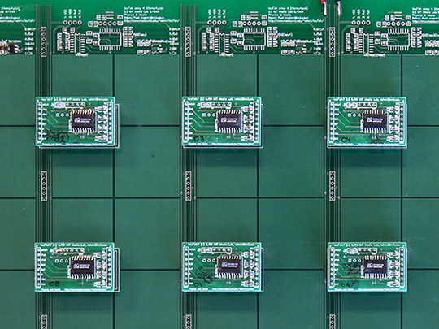
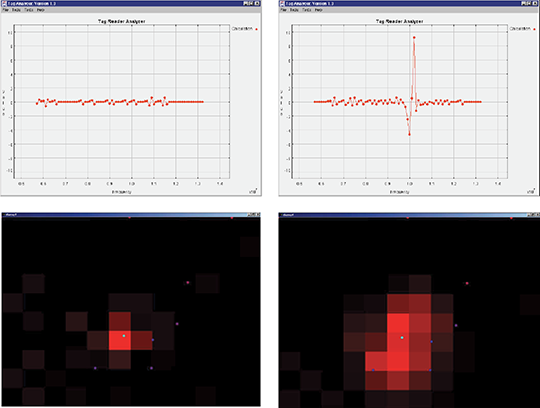
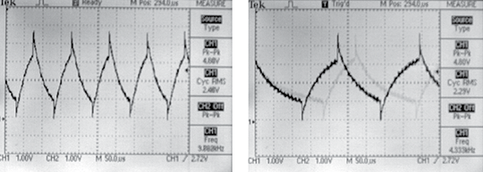
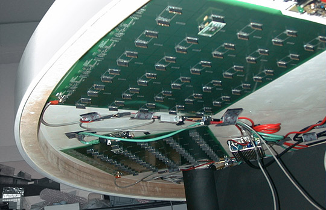
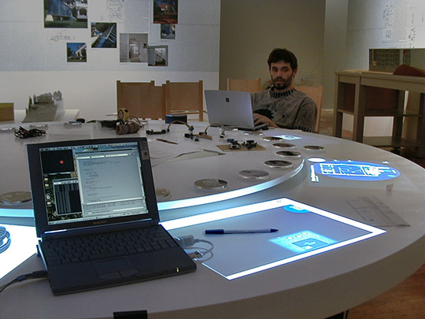
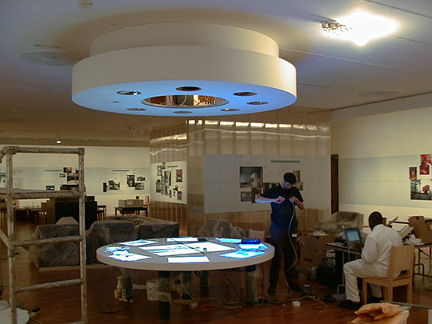
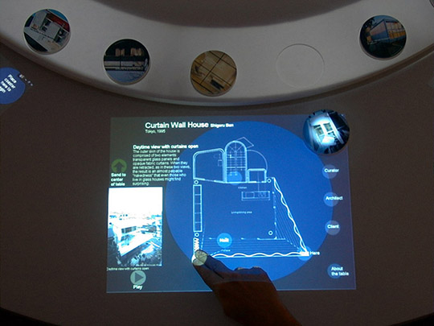

+++
title = "Multitouch Table at MoMA"
project_date = "1999"
tags = ["interaction", "sensors", "art"]
project_thumb = "/assets/thumbnails/sensors/taufish/thumb.jpg"
+++

# Multitouch Table at MoMA

## Overview

For the Museum of Modern Art's 1999 ["Un-Private House" exhibition](http://www.moma.org/interactives/exhibitions/1999/un-privatehouse/credits.html), we built a table that could tell where visitors' hands were — on the surface and in the air above it — with nothing to touch but the table itself: no camera, no overlay, just an array of electrodes hidden beneath the surface.

## How it senses

Each electrode in the array is charged and discharged continuously, and the electronics measure how quickly charge accumulates. A hand near an electrode loads it: more charge is needed, so the rate slows, and the slowing falls off with distance. Comparing the readings across the array against a model of the expected loading locates a hand in x and y and tells when it enters a designated "hotspot."

The sensor behind the table was the **tauFish**, the simplest of a family of electric field sensing instruments (Fish, SmartFish, LazyFish, tauFish) developed at the MIT Media Lab. Where its predecessors used synchronous detection, the tauFish simply times each electrode's charging — and it is the measurement of this time constant, τ, that gives the tauFish its name.

- **Paper:** [An Installation of Interactive Furniture](/assets/pdf/omojola-isj393-part3.pdf), O. Omojola, E. R. Post, M. D. Hancher, J. P. Strachan, P. Russo, N. Gershenfeld, *IBM Systems Journal* **39**(3–4), 2000.

## Gallery

