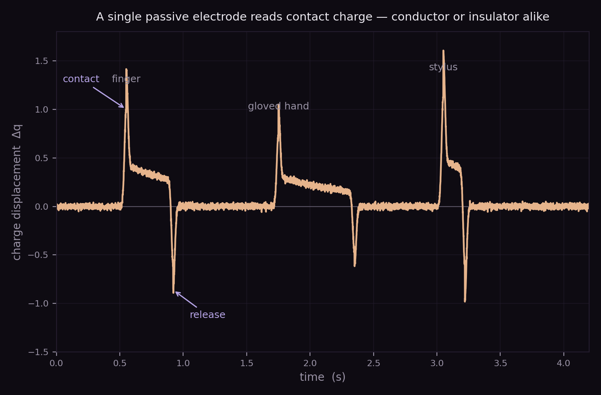

+++
title = "TriboTouch"
project_date = "2013–2019"
tags = ["interaction", "sensors"]
project_thumb = "/assets/thumbnails/other/tribotouch/thumb.svg"
+++

# TriboTouch

## Overview

**TriboTouch** is a triboelectric touch-sensing technology developed at Samsung Research
America's Think Tank Team — taken from initial invention and prototyping through to a production
ASIC/SoC. Where a conventional touchscreen drives the panel with a signal and
measures capacitance, TriboTouch is *passive*: it senses the small charge displaced when two
surfaces come into contact or separate. Because that contact charge appears whether or not the
touching object conducts, a single TriboTouch electrode can register a bare finger, a gloved
hand, a brush, or a plastic stylus alike.

The name is coined and used throughout the technology's patent specifications, which carry a
priority date of August 13, 2013.

## How it works

- **Triboelectric charge.** When two dissimilar materials touch and separate they exchange
  charge — the everyday "static electricity" of triboelectricity, contact potential difference,
  and work function. TriboTouch measures the charge displaced by that contact directly.
- **A single passive electrode.** No drive signal is required: charge is generated and received
  at the sensing surface when an object touches it, and a charge amplifier reads out the
  resulting change, Δq.
- **Conductors *and* insulators.** Because it senses displaced charge rather than a change in
  capacitance to ground, it responds to insulating objects — gloves, brushes, non-conductive
  styluses — as well as to conductive fingers.
- **Dual mode: touch and hover.** The same electrode can passively sense both the charge
  displacement of a contact and the change in the ambient electromagnetic field as an object
  approaches — yielding touch *and* proximity from one sensor.
- **From lab to silicon.** The effort ran from first prototypes through a production ASIC/SoC; a
  later member of the patent family adds electric-field tomography — a transparent resistive
  sheet with edge electrodes — to localize touches across a surface.

## Two projects named "TriboTouch"

Both names trace to the Greek *τρίβω* ("to rub"), but they name two different pieces of work
with different physics. For clarity:

| | Samsung / E. R. Post — TriboTouch | CMU — TriboTouch (Shultz, Kim, Ahuja, Harrison) |
|---|---|---|
| First in public record | Interaction-sensing patents, priority 2013 (published 2015; granted from 2017) | CHI 2022 paper |
| "Tribo-" | Triboelectricity (contact charge) | Tribology (the study of friction) |
| Mechanism | Passive charge displacement on contact / separation | Micro-patterned surface → friction-induced acoustic vibration + machine learning |
| Problem solved | Touch, proximity, and material sensing | Reducing touchscreen tracking latency |

The Carnegie Mellon project — Craig Shultz, Daehwa Kim, Karan Ahuja, and Chris Harrison,
"TriboTouch: Micro-Patterned Surfaces for Low Latency Touchscreens," *CHI 2022* — is a separate,
later project that shares the name. It lays a thin micro-patterned film over a touchscreen and
uses the faint acoustic vibration of a finger dragging across the texture, fused with machine
learning, to cut tracking latency. It solves a different problem by a different mechanism
(friction and acoustics rather than triboelectric charge), and is noted here only to
disambiguate the shared name.

## Patents

The triboelectric TriboTouch is documented in Samsung's "Interaction sensing" patent family (priority 2013):

- [Interaction Sensing — US9569055](https://patents.google.com/patent/US9569055B2) (2017)
- [Interaction Sensing — US10013132](https://patents.google.com/patent/US10013132B2) (2018)
- [Interaction Sensing — US10042504](https://patents.google.com/patent/US10042504B2) (2018)
- [Interaction Sensing — US10108305](https://patents.google.com/patent/US10108305B2) (2018)
- [Interaction Sensing — US10318090](https://patents.google.com/patent/US10318090B2) (2019)
- [Interaction Sensing — US10955983](https://patents.google.com/patent/US10955983B2) (2021)
- [Interaction Modes for Object-Device Interactions — US10042446](https://patents.google.com/patent/US10042446B2) (2018)
- [Touch Detection Using Electric Field Tomography — US11237687](https://patents.google.com/patent/US11237687B2) (2022)

See the [patents page](/PATENTS/) for the complete portfolio.

## Credits

Developed at the Samsung Research America Think Tank Team, with co-inventors including
Olivier Bau, Iliya Tsekov, Sajid Sadi, Mike Digman, Vatche Attarian, and Sergi Consul.
