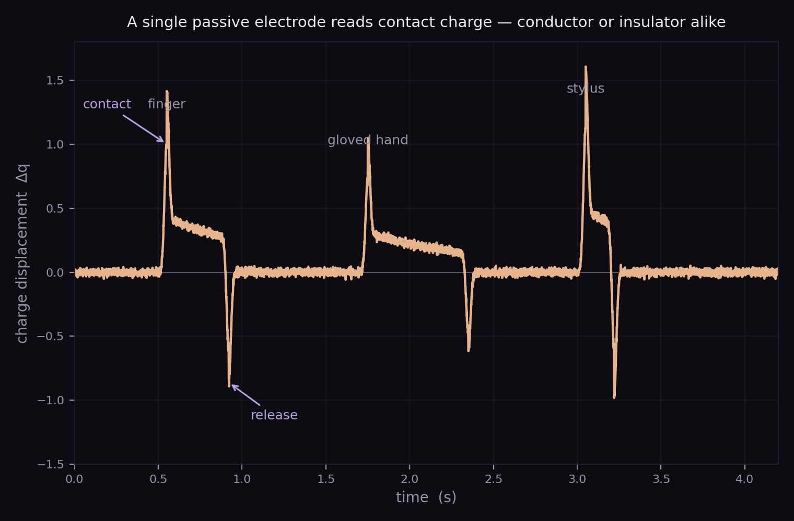

+++
title = "TriboTouch"
project_date = "2013–2019"
tags = ["interaction", "sensors"]
project_thumb = "/assets/thumbnails/other/tribotouch/thumb.svg"
+++

# TriboTouch

## Overview

Anyone who has tried to work a touchscreen in winter gloves knows the limit of capacitive
sensing: the screen senses conductors, and a wool glove is not one. **TriboTouch** starts from a
different physical effect. When any two dissimilar surfaces touch and separate, they exchange a
small amount of charge — the same contact electrification that leaves "static" on everything —
and they do so whether or not either surface conducts. TriboTouch senses that exchanged charge
directly, so a single electrode registers a bare finger, a gloved hand, a brush, or a plastic
stylus alike.

The technology was developed at Samsung Research America's Think Tank Team, from first
prototypes through to a production ASIC/SoC.

## How it works

A conventional touchscreen is an active instrument: it drives the panel with a signal and
measures how an approaching finger changes the capacitance between electrodes. TriboTouch
applies no drive signal at all. The sensing surface itself generates the signal — at the moment
of contact, charge is displaced between the touching object and the electrode, and a charge
amplifier reads out that displacement, Δq. The trace at the top of this page is what one
passive electrode sees: a transient at each contact and another at each release, with nothing
between them but noise.

Sensing displaced charge rather than capacitance to ground is what opens the door to
insulators. A conductive finger and a nylon brush deposit different amounts of charge, but both
deposit *some* — contact electrification is universal — so both register, and the character of
the transient carries information about what the touching material is.

The same electrode also works before contact. An approaching object perturbs the ambient
electromagnetic field around the electrode, and the amplifier picks that up too — so one
passive sensor yields both hover and touch, proximity from the field change and contact from
the charge transient.

A single electrode tells *that* and *what*, but not *where*. A later member of the patent
family adds the missing coordinate by electric-field tomography: a transparent resistive sheet
with electrodes only at its edges, from which the location of a touch anywhere on the surface
is reconstructed — no row-and-column grid across the display.

## A note on the name

A separate Carnegie Mellon project published under the same name in 2022 — Shultz, Kim, Ahuja,
and Harrison, ["TriboTouch: Micro-Patterned Surfaces for Low Latency
Touchscreens"](https://doi.org/10.1145/3491102.3502081), *CHI 2022*. Both names come from the
Greek *τρίβω*, "to rub," but they name different physics: this page's TriboTouch is about
triboelectricity, the charge that contact leaves behind; the CMU project is about tribology,
using the faint acoustics of friction (plus machine learning) to cut touchscreen latency. The
Samsung patent family predates it, with a priority date of August 13, 2013; the CMU work is
noted here only to keep the shared name straight.

## Patents

The triboelectric TriboTouch is documented in Samsung's "Interaction sensing" patent family (priority 2013):

- [Interaction Sensing — US9569055](https://patents.google.com/patent/US9569055B2) (2017)
- [Interaction Sensing — US10013132](https://patents.google.com/patent/US10013132B2) (2018)
- [Interaction Sensing — US10042504](https://patents.google.com/patent/US10042504B2) (2018)
- [Interaction Sensing — US10108305](https://patents.google.com/patent/US10108305B2) (2018)
- [Interaction Sensing — US10318090](https://patents.google.com/patent/US10318090B2) (2019)
- [Interaction Sensing — US10955983](https://patents.google.com/patent/US10955983B2) (2021)
- [Interaction Modes for Object-Device Interactions — US10042446](https://patents.google.com/patent/US10042446B2) (2018)
- [Touch Detection Using Electric Field Tomography — US11237687](https://patents.google.com/patent/US11237687B2) (2022)

See the [patents page](/PATENTS/) for the complete portfolio.

## Credits

Developed at the Samsung Research America Think Tank Team, with co-inventors including
Olivier Bau, Iliya Tsekov, Sajid Sadi, Mike Digman, Vatche Attarian, and Sergi Consul.
