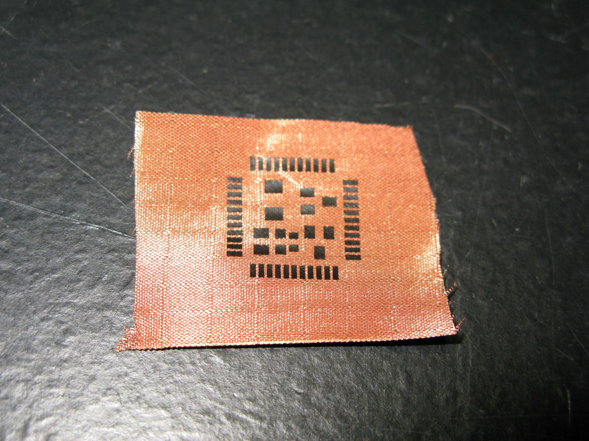
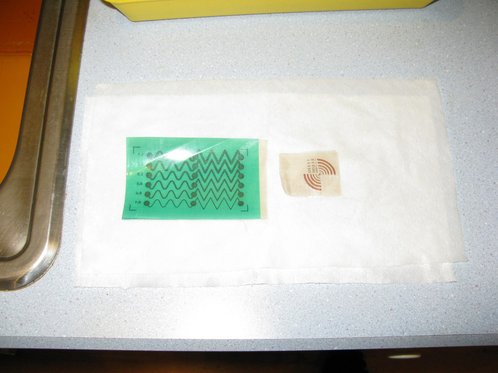

+++
title = "µTartan"
project_date = "2009"
tags = ["e-textiles", "wearables", "hardware"]
project_thumb = "/assets/thumbnails/wearables-and-textiles/utartan/thumb.jpg"
+++

# µTartan

## Overview

µTartan is a macroscale experiment in patterning circuits directly in textile — forming conductive
traces, chip footprints, and coils in woven conductive fabric at a scale you can see, with feature
sizes on the order of a millimetre rather than the microns of a silicon chip. Where [e-broidery](/projects/e-broidery/)
*stitches* conductors along a path, µTartan treats the woven cloth itself as the circuit substrate:
the tartan-like grid of the weave becomes the canvas on which pads, tracks, and antennas are laid out.

## What it explores

- **Circuits in the weave.** A pattern — here a chip land pattern with fan-out traces — is formed in a
  copper-conductive textile, so the fabric carries both structure and circuit.
- **How fine can it go.** Test cards sweep line widths from roughly 0.4 to 1.4 mm to find the finest
  features the process holds, along with serpentine traces and spiral coils for resistors and antennas.
- **Textile, not silicon.** The point is fabrication that stays soft and woven — keeping the feel and
  drape of cloth while carrying a working layout.

~~~
<figure style="margin:1.5rem 0;">
  
  <figcaption style="font-size:0.85rem;color:var(--muted);margin-top:0.5rem;text-align:center;">Resolution test cards — serpentine traces at graded line widths and a spiral coil, at millimetre scale.</figcaption>
</figure>
~~~

## Context

µTartan sits in the e-textile thread of this portfolio alongside [e-broidery](/projects/e-broidery/)
and the wearable pieces it enabled — different routes to the same goal of a circuit that is also a cloth.
