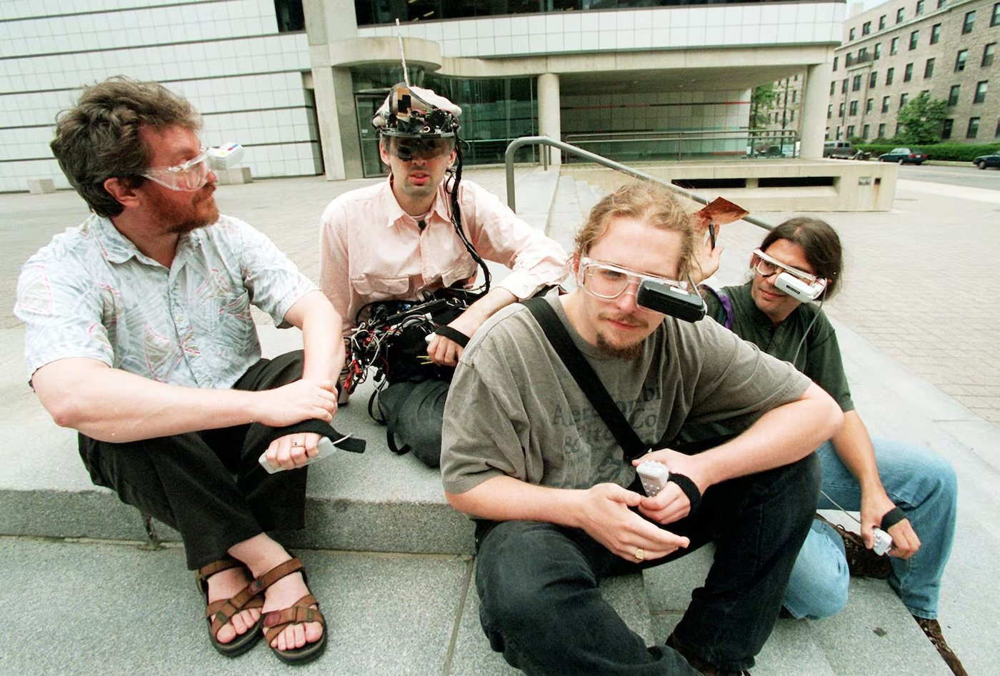

+++
title = "Wearable Computing"
project_date = "1995 - 2000"
tags = ["wearables", "computing", "e-textiles"]
project_thumb = "/assets/thumbnails/wearables-and-textiles/wearable-computing/thumb.jpg"
+++

# Wearable Computing

## The Borgs

The MIT "Borgs" were the Media Lab's wearable-computing group in the mid-1990s — a handful of people living in always-on computers worn on the body, read through a heads-up display and typed on a one-handed Twiddler. The independently built machine that led to joining them grew into [HackMan 0.4](/projects/hackman/), whose page tells that arrival story.

## Historical Context

Pushing the boundaries of personal, always-on computing in the mid-1990s, this work laid important foundations for many of the wearable technologies we take for granted today, from smartwatches to augmented-reality glasses.

## Impact

This early work in wearable computing helped establish many of the fundamental principles and challenges in the field:
- Integration of computing into daily life
- Always-on, always-available computing
- Human-computer interaction in mobile contexts
- Power and heat management
- Social implications of wearable technology

The experience and insights gained during this period influenced many later projects in e-textiles and wearable technology.