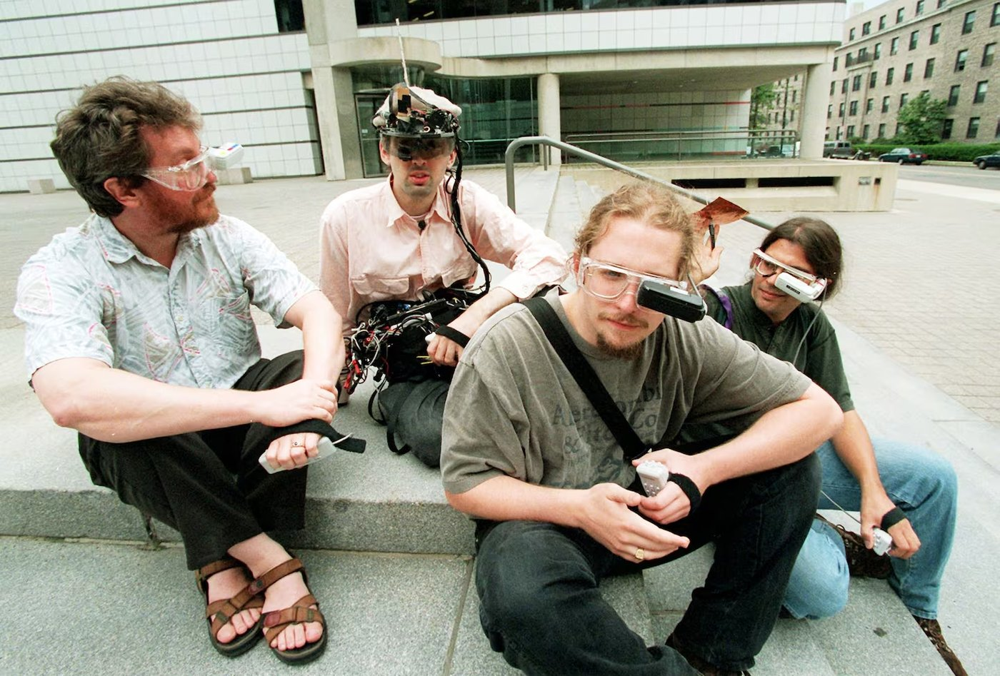

+++
title = "Wearable Computing"
project_date = "1995 - 2000"
tags = ["wearables", "computing", "e-textiles"]
project_thumb = "/assets/thumbnails/wearables-and-textiles/wearable-computing/thumb.jpg"
+++

# Wearable Computing

## The Borgs

The MIT "Borgs" were the Media Lab's wearable-computing group in the mid-1990s — a handful of people living in always-on computers worn on the body, read through a heads-up display and typed on a one-handed Twiddler. The independently built machine that led to joining them grew into [HackMan 0.4](/projects/hackman/), whose page tells that arrival story.

## What living in a computer teaches

Wearing a computer all day is different from carrying one, and the difference is where the
research was. Daily use surfaced the problems that came to define the field: power and heat on
a body, one-handed input, a display you look *through* rather than at, and the social fact of
holding a conversation with someone who is also reading a screen.

One conclusion from those years runs through the rest of this portfolio: the machine should
disappear into the clothing itself. That is the road that leads to
[e-broidery](/projects/e-broidery/) and the garments built with it.