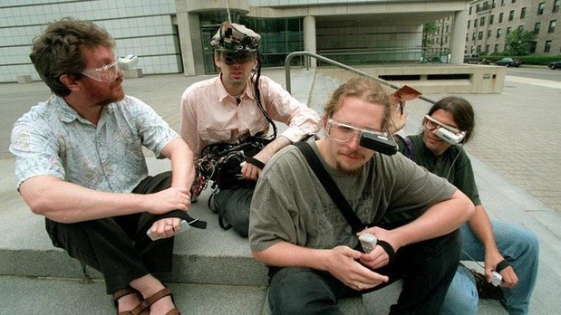

+++
title = "Wearable Computing"
project_date = "1995 - 2000"
tags = ["wearables", "cyborgs", "computing", "e-textiles"]
project_thumb = "/assets/thumbnails/wearables-and-textiles/wearable-computing/thumb.jpg"
+++

# Wearable Computing

## Origins

In 1994, I had a serendipitous encounter with Thad Starner and his wearable computer (named "Lizzy") in a coffee shop. This meeting would prove to be pivotal in my career trajectory. A few months later, after showing Thad the wearable computer I had independently built, he invited me to join him and the other members of the "Borg" as a graduate student at the MIT Media Lab.

## Historical Context

The MIT "Borgs" were a pioneering group in wearable computing, pushing the boundaries of what was possible with personal, always-on computing devices in the mid-1990s. This work laid important foundations for many of the wearable technologies we take for granted today, from smartwatches to augmented reality glasses.

## Impact

This early work in wearable computing helped establish many of the fundamental principles and challenges in the field:
- Integration of computing into daily life
- Always-on, always-available computing
- Human-computer interaction in mobile contexts
- Power and heat management
- Social implications of wearable technology

The experience and insights gained during this period influenced many of my later projects in e-textiles and wearable technology.